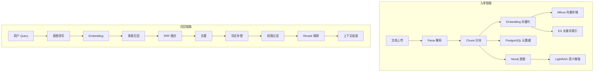
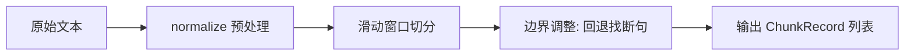
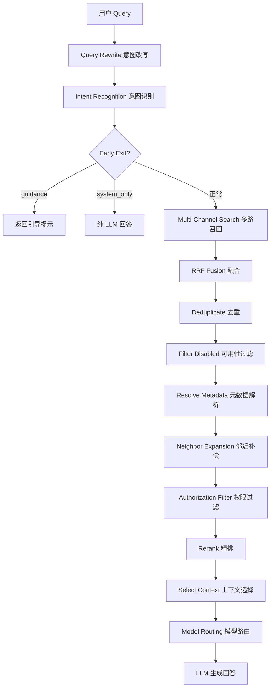
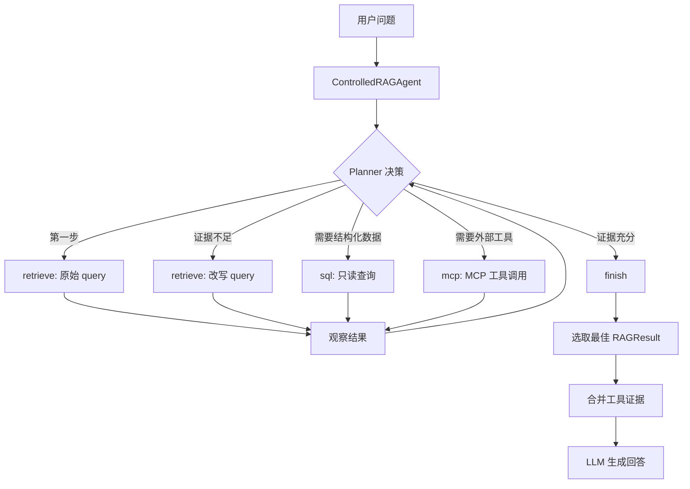
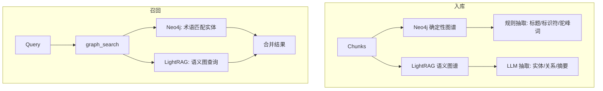
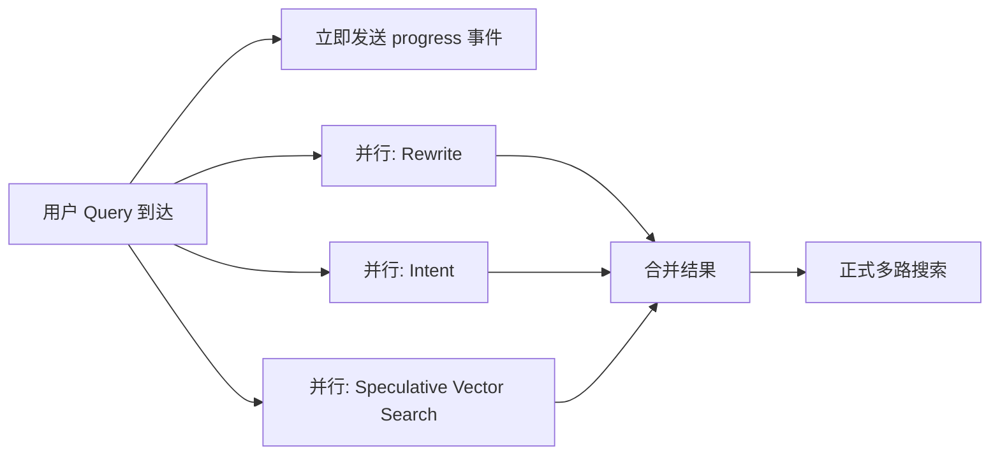

# FlavorAG RAG 全链路实现详解

## 整体架构概览



---

## 一、入库链路（Ingestion Pipeline）

入库流程由 `IngestionPipeline` 编排，完整流程为：

```
Parse → Chunk → Embed → Save(PG) → Index(Milvus) → Index(ES) → Graph Sync(Neo4j + LightRAG)
```

### 1. Chunk 分块（核心）

分块是 RAG 系统中最关键的环节——切分质量直接决定了召回的上限。本项目实现了 **三种分块策略**，适配不同文档类型。

#### 1.1 策略总览

| 策略 | 枚举值 | 适用场景 | 核心思想 |
|------|--------|----------|----------|
| FIXED_WINDOW | `fixed_size` | 纯文本、无结构文档 | 固定窗口滑动切分，重叠保上下文 |
| SEMANTIC | `structure_aware` | Markdown 文档 | 识别标题/代码/图片等结构，按语义块打包 |
| BLOCK_AWARE | `block_aware` | 复杂文档（含表格/代码/列表） | 按块类型分发到专用子切分器 |

用户通过 `ChunkConfig(strategy, chunk_size, overlap)` 配置，系统自动解析为对应策略的选项对象。

#### 1.2 FIXED_WINDOW — 固定窗口切分

**原理**：以 `chunk_size` 为窗口大小、`overlap_size` 为重叠步长，在文本上滑动切分。

**关键细节**：

1. **文本预处理（normalize）**：
   - 修复被换行打断的 URL（检测 `http://` / `https://` 前缀，跨行拼接）
   - 修复 CJK 文字中间的错误换行（前后都是汉字时删除换行符）
   - 统一 `\r\n` → `\n`

2. **边界调整（adjustToBoundary）**：切分点不硬切在固定位置，而是在 overlap 范围内向前回退寻找自然断点：
   - 优先级 1：换行符 `\n`
   - 优先级 2：中文句末标点 `。！？`
   - 优先级 3：英文句末标点 `.!?`（后跟空格或文末）
   - 兜底：强制在 target_end 处切分

3. **防死循环**：如果边界调整后 `end <= start`，强制推进到 `target_end`。



**默认参数**：`chunk_size=512, overlap_size=128`

#### 1.3 SEMANTIC — 语义感知切分

**原理**：先线性扫描文档识别结构块（Block），再将相邻块打包到目标大小范围内。

**三阶段流程**：

**阶段一：块识别（Segment to Blocks）**

逐行扫描，识别 4 种块类型：
- `HEADING`：匹配 `^#{1,6}\s+`
- `CODE`：匹配 ` ``` ` 围栏，直到闭合
- `ATOMIC`：独立图片 `` 或独立链接 `[text](url)`
- `PARA`：普通段落（空行分隔）

块间的空白区域会被合并到前一个块中（coalesce trailing blanks）。

**阶段二：块打包（Pack Blocks to Chunks）**

贪心算法将连续块打包：
- 累加块直到超过 `max_chars`（默认 1800）
- 如果当前包太小（< `min_chars` 600），强制吸收下一个块
- 最后一个过小的包合并到前一个

**阶段三：物化 + 重叠（Materialize with Overlap）**

每个 chunk 头部拼接前一个 chunk 的尾部 `overlap_chars` 个字符，保证上下文连贯。

**默认参数**：`target_chars=1400, overlap_chars=0, max_chars=1800, min_chars=600`

#### 1.4 BLOCK_AWARE — 块感知切分（最复杂）

**原理**：识别 6 种块类型，每种类型有专用的子切分策略。核心创新是**表格双文本分离**。

**块类型与子切分器**：

| 块类型 | 子切分器 | 策略 |
|--------|----------|------|
| HEADING | 无（作为路径前缀） | 维护 `current_heading_path`，最多 4 层 |
| TABLE | TableChunker | 按行预算切分 + 生成 key:value 嵌入文本 |
| CODE | CodeChunker | 按行数预算切分（默认 80 行） |
| LIST | ListChunker | 按条目数切分（默认 30 条） |
| IMAGE | ImageChunker | 保留原始 markup，alt 文本作为 embedding_text |
| PARA | ParagraphChunker | 按字符预算 + 句子边界切分 |

**表格双文本（核心创新）**：

```
content（人读）:          embedding_text（机读）:
| 姓名 | 年龄 | 城市 |    headers: 姓名, 年龄, 城市
| --- | --- | --- |       姓名: 张三; 年龄: 28; 城市: 北京
| 张三 | 28 | 北京 |      姓名: 李四; 年龄: 32; 城市: 上海
| 李四 | 32 | 上海 |
```

- `content`：保留原始 Markdown 表格格式（含表头），供 LLM 阅读
- `embedding_text`：转换为 `列名: 值` 的 key:value 格式，因为 Embedding 模型无法理解表格的列对齐关系

**标题路径注入**：

每个 chunk 的 content 和 embedding_text 头部都会注入当前标题路径：
```
[产品手册 > 安装指南 > Linux 环境]
（chunk 正文）
```

**小块合并（ChunkPacker）**：

- 只有 `PARAGRAPH`、`LIST`、`IMAGE` 类型可以合并
- `TABLE`、`CODE` 是原子块，永不合并且打断合并链
- 相邻小块（< `min_chars` 300）累积合并直到达到阈值

**默认参数**：`target_chars=800, max_chars=1200, min_chars=300, overlap_chars=50, table_max_rows=20, code_max_lines=80, list_max_items=30`

#### 1.5 PDF 多模态分块

对于 PDF 文档，使用专门的 `StructuredPdfChunker`：
- 解析 PDF 为结构化文档（含 blocks + assets）
- 图片通过 VLM（视觉语言模型）生成描述文本
- 表格按 `pdf_table_max_rows` 行预算切分
- 图片/表格资产上传到 S3 对象存储，chunk 中记录 `asset_ids`

#### 1.6 ChunkRecord 输出结构

每个 chunk 最终输出为：
```python
{
    "content": "人读文本（含标题路径前缀）",
    "chunk_index": 0,
    "char_count": 856,
    "block_type": "TABLE",           # 块类型标签
    "embedding_content": "机读文本",   # 为空时用 content 代替
    "metadata_json": {"outline_path": ["章", "节"]},
}
```

---

### 2. Embedding 向量化

**实现**：`EmbeddingClient`，兼容 OpenAI Embedding API 协议。

| 配置项 | 默认值 | 说明 |
|--------|--------|------|
| 模型 | `Qwen/Qwen3-Embedding-8B` | SiliconFlow 托管 |
| 维度 | 4096 | 向量维度 |
| 批大小 | 16 | 每批最多 16 条文本 |
| 查询缓存 | LRU 256 | 避免重复 embed 相同 query |

**关键设计**：
- **入库时**：优先使用 `embedding_content`（搜索优化文本），为空时降级到 `content`
- **查询时**：LRU 缓存 + 可配置超时（25s）+ 重试（最多 1 次）
- **批间休眠**：每批之间 sleep 50ms，避免触发 API 限流
- **指数退避重试**：失败后 `0.5 * 2^attempt + random jitter` 秒后重试

---

### 3. 存储层

#### 3.1 Milvus 向量存储

**Collection Schema**：

| 字段 | 类型 | 说明 |
|------|------|------|
| id | INT64 (PK, auto) | 自增主键 |
| chunk_id | VARCHAR(64) | 关联 PG 的 chunk ID |
| doc_id | VARCHAR(64) | 所属文档 ID |
| content | VARCHAR(65535) | chunk 原文 |
| embedding | FLOAT_VECTOR(4096) | 向量 |

**索引配置**：
- 索引类型：`IVF_FLAT`（倒排文件 + 暴力搜索）
- 距离度量：`COSINE`（余弦相似度）
- nlist=128（聚类中心数）
- 搜索时 nprobe=16（探测聚类数）

**Collection 命名**：`rag_{collection_name}`，每个知识库一个 collection。

**自愈机制**：当 Embedding 模型变更导致维度不匹配时（如 1536→4096），自动 drop 并重建 collection。

#### 3.2 Elasticsearch 关键词索引

**Index 名称**：`rag_keyword_store`（全局单一索引，通过 `kb_id` 字段过滤）

**Mapping 设计**：
```json
{
  "kb_id": "keyword",
  "tenant_id": "keyword",
  "doc_id": "keyword",
  "block_type": "keyword",
  "chunk_index": "integer",
  "content": "text (ik_max_word / ik_smart)",
  "embedding_content": "text (ik_max_word / ik_smart)"
}
```

**分词器**：
- 入库分词：`ik_max_word`（最细粒度切分，提高召回）
- 搜索分词：`ik_smart`（智能切分，提高精度）
- 降级：IK 插件未安装时自动降级为 `standard`

**写入方式**：`async_bulk` 批量写入，失败不阻塞入库主流程（best-effort）。

#### 3.3 PostgreSQL 元数据

存储 chunk 的完整元数据：`content_hash`、`block_type`、`page_start/end`、`bbox_json`、`metadata_json`（含 asset_ids）、权限字段（tenant_id, department_id）等。

`content_hash = sha256(content)[:16]` 用于召回时的精确匹配和去重。

---

## 二、召回链路（Retrieval Pipeline）

完整召回流程由 `RAGPipeline` 编排：



### 1. Query Rewrite 意图改写

**三层改写机制**：

1. **术语映射（Term Mapping）**：
   - 从数据库加载全局 + KB 级映射规则（如 "K8s" → "Kubernetes"）
   - 按源术语长度降序匹配，避免短词误替换
   - 命中后异步更新 hit_count 统计

2. **LLM 改写**：
   - 输入：最近 6 轮对话 + 当前问题
   - 任务：消解指代、补全省略、口语转书面语
   - 输出：`{"rewrite": "改写后", "sub_queries": ["子问题1", "子问题2"]}`
   - 约束：不得添加用户没有表达的事实

3. **复合问题分解**：
   - 按 `?？；;\n` 以及 "另外/以及/并且/同时/然后/还有" 等连接词拆分
   - 最多保留 `max_subqueries`（默认 3）个子问题

**TTFT 优化**：rewrite 和 intent 并行执行（`asyncio.gather`），同时用原始 query 进行投机搜索（speculative search），rewrite 完成后合并结果。

### 2. Intent Recognition 意图识别

基于数据库 `IntentNode` 表的分类体系：

| 意图 | 描述 |
|------|------|
| code_search | 代码/函数/API 查询 |
| document_qa | 文档/指南/手册查询 |
| knowledge_qa | 知识库/专业知识查询 |
| data_query | 结构化数据/统计查询 |
| general | 通用问答 |

**特殊路径**：
- `needs_guidance`：问题太模糊，返回引导提示让用户补充
- `system_only`：纯闲聊/系统问题，不走检索直接用 LLM 回答
- 意图决定搜索通道选择（`search_channels`）和 prompt 模板

### 3. 多路召回（Multi-Channel Search）

三路并行搜索，每路用所有 subqueries 并发查询：

| 通道 | 实现 | 特点 |
|------|------|------|
| **vector** | MilvusSearchChannel | 语义相似度，COSINE 距离 |
| **keyword** | ESKeywordSearchChannel | BM25 全文匹配，精确术语命中 |
| **graph** | Neo4jGraphStore + LightRAGClient | 实体关系推理，跨文档关联 |

**治理机制**：
- 每通道独立 `CircuitBreaker`（连续失败 3 次 → 熔断 30s）
- 通道超时：`channel_timeout_ms`（默认 30s）
- 总超时：`total_timeout_ms`（默认 35s）
- 每通道 top_k=12

**通道权重**（RRF 融合时使用）：
```
vector: 1.0, keyword: 1.0, graph: 0.65
```

### 4. RRF 融合（Reciprocal Rank Fusion）

**公式**：对每个唯一 chunk，RRF 分数 = Σ (weight / (k + rank + 1))

- k=60（平滑常数，来自原始 RRF 论文）
- rank 从 0 开始（rank 0 = 该通道最佳结果）
- weight 为通道权重

**输出元数据**：
```python
result.metadata = {
    "fusionScore": 0.0328,           # RRF 总分
    "matchedChannels": ["vector", "keyword"],  # 命中通道
    "channelScores": {               # 各通道明细
        "vector": {"rank": 1, "rawScore": 0.87, "weight": 1.0, "rrfContribution": 0.0164},
        "keyword": {"rank": 3, "rawScore": 12.5, "weight": 1.0, "rrfContribution": 0.0156},
    }
}
```

### 5. 去重（Deduplicate）

- 算法：字符 3-gram Jaccard 相似度
- 阈值：≥ 0.9 视为近似重复
- 重复项的通道归属信息合并到保留项（不丢失多通道命中证据）

### 6. 邻近补偿（Neighbor Expansion）

**目的**：召回的 chunk 可能只是一段话的中间部分，前后文对理解至关重要。

**实现**：
1. 取融合后 top-10 高分结果作为锚点
2. 对每个锚点，在 PG 中查询同文档的 `chunk_index ± 2` 范围内的 chunk
3. 排除已存在的 chunk，将邻居加入候选池
4. 邻居 chunk 的 score 设为锚点 score × 0.85（衰减）

**触发条件**：用户请求参数 `neighbor_expansion=true` 时启用。

### 7. Rerank 精排

**策略**：Cross-Encoder（默认）

| 配置 | 值 |
|------|------|
| 模型 | `Qwen/Qwen3-Reranker-8B` |
| API | SiliconFlow `/rerank` |
| 超时 | 15s |
| 熔断 | 连续 3 次失败 → 降级为截断 |

**流程**：
1. 将所有候选（含邻居）的 content 发送到 Reranker API
2. 返回 `relevance_score` 重排
3. `select_context` 进行最终筛选：
   - 过滤 score < `min_relevance_score`（0.01）的结果
   - 文档多样性：轮询不同 doc_id 的结果（Round-Robin）
   - 字符预算：累计不超过 `context_max_chars`（12000）
   - 数量预算：最多 `final_top_k`（5）个

**降级策略**：
- Reranker 不可用 → 直接截取 fusion 排序的 top_n
- 支持 LLM_BASED 模式（prompt LLM 重排，备用）

---

## 三、Agentic RAG

### 设计理念

传统 RAG 是"一次检索定终身"——如果第一次检索结果不好，就只能硬着头皮用。Agentic RAG 引入了 **Agent 循环**：让 LLM 作为规划器（Planner），判断当前证据是否充分，不充分就换个 query 再检索，或者调用其他工具补充证据。

### 架构



### 核心组件

#### ControlledAgent（受控 Agent）

```python
class ControlledAgent:
    def __init__(self, registry, planner, max_steps=4):
        ...
    async def run(self, question, context) -> AgentResult:
        for _ in range(self.max_steps):
            action = await self.planner(state)
            if action.tool == "finish":
                return AgentResult("completed", ...)
            if signature in seen_calls:  # 防重复调用
                return AgentResult("repeated_call", ...)
            observation = await self.registry.invoke(action.tool, action.arguments, context)
            steps.append(AgentStep(action, observation))
        return AgentResult("budget_exhausted", ...)
```

**安全约束**：
- **步数上限**：`max_steps=4`，绝不无限循环
- **去重**：相同 (tool, arguments) 签名不会重复执行
- **只读**：ToolRegistry 拒绝执行非 read_only 的工具
- **超时**：每个工具调用有独立超时
- **输出截断**：工具输出超过 12000 字符自动截断

#### Planner（规划器）

决策逻辑：
1. **第一步**：无条件执行 `retrieve(原始 query)`
2. **后续步**：如果上一步 `answerable=True`，直接 finish
3. **否则**：调用 LLM 生成下一步动作
   - System prompt 约束：只能选白名单内的工具、不能重复、只返回 JSON
   - 输入：原始问题 + 最近 3 步的观察结果
   - 输出：`{"tool": "retrieve", "arguments": {"query": "更精确的查询"}}`

#### 工具注册表

| 工具 | 条件 | 功能 |
|------|------|------|
| `retrieve` | 始终可用 | 执行完整 RAG Pipeline 检索 |
| `sql` | `sql_tool_enabled=True` | 只读 SQL 查询（白名单表、强制 tenant 过滤、强制 LIMIT） |
| MCP 工具 | `mcp_tool_enabled=True` | 调用外部 MCP 服务端点 |

#### 结果选取

Agent 循环结束后：
1. 从所有 retrieve 结果中选取最后一个 `answerable=True` 的
2. 如果所有检索都不可回答，但有工具证据（sql/mcp），将工具输出作为 chunk 注入上下文
3. 工具证据的 `blockType` 标记为 `TOOL_RESULT`

### 前端交互

- SSE 流中发送 `event: agent` 事件，包含所有步骤的 tool/arguments/observation
- 前端可展示 Agent 的推理过程（类似 CoT 可视化）
- 消息持久化时保存 `agent_steps` JSON 字段

---

## 四、Graph RAG

### 设计理念

向量搜索擅长语义匹配，但对"实体间关系"无能为力。例如："张三所在部门的负责人是谁？"——这需要跨越多个文档的关系推理。Graph RAG 通过构建知识图谱来补充这一能力。

### 双层图谱架构



#### 层 1：Neo4j 确定性图谱（Neo4jGraphStore）

**定位**：可靠的本地图谱，不依赖外部 LLM，保证 Graph RAG 始终有真实可追溯的 chunk 证据。

**入库 — 实体抽取（规则式）**：

从每个 chunk 的 content 中抽取实体：
1. **标题实体**：匹配 `^#{1,6}\s+(.{2,80})$`，类型 = "section"
2. **代码标识符**：匹配反引号 `` `identifier` ``，类型 = "identifier"
3. **驼峰/路径标识符**：匹配 `PascalCase` 或 `path/to/file` 模式

每个 chunk 最多抽取 12 个实体，过滤常见噪音词（typescript, javascript, string 等）。

**入库 — 关系构建**：

同一 chunk 内的实体两两建立 `FLAVOR_RELATED` 关系（共现关系）：
- 每 chunk 最多 8 个实体参与关系构建（避免二次方爆炸）
- 关系属性：`label='共现'`, `weight=1.0`, `chunk_id`, `doc_id`, `kb_id`

**入库 — Neo4j 写入**：
```cypher
-- 先删除该文档旧实体
MATCH (n:FlavorEntity {kb_id: $kb_id, doc_id: $doc_id}) DETACH DELETE n

-- 批量 MERGE 实体节点
MERGE (entity:FlavorEntity {id: row.id})
SET entity.name, entity.entity_type, entity.description, entity.content, ...

-- 批量 MERGE 关系
MERGE (source)-[relation:FLAVOR_RELATED {chunk_id: row.chunk_id}]->(target)
```

**实体 ID 生成**：`flavor:{sha256(kb_id:doc_id:name.casefold())[:24]}`

**召回 — 图搜索**：

1. 从 query 中提取术语（英文标识符 + 中文词，最多 12 个）
2. Cypher 查询：实体 name 或 description 包含任一术语
3. 评分：name 命中 = 1.0，description 命中 = 0.72
4. 返回实体关联的原始 chunk content 作为 SearchResult

#### 层 2：LightRAG 语义图谱（LightRAGClient）

**定位**：基于 LLM 的深度语义图谱增强，抽取更丰富的实体关系和摘要。

**入库**：
- 将同一文档的所有 chunk 拼接后发送到 LightRAG `/documents/text` API
- LightRAG 内部用 LLM 抽取实体、关系、生成社区摘要
- 以 `file_source = {collection_name}_{doc_id}` 作为文档标识

**召回**：
- 调用 `/query` API，mode="mix"（混合模式：local + global）
- 参数：`only_need_context=True, include_references=True, include_chunk_content=True`
- 返回 references 列表，按 `1/(rank+1)` 赋分
- 通过 `scope_tokens`（kb_id, collection_name）过滤非本知识库的结果

**容错**：
- LightRAG 超时（max 1.5s）→ 仅使用 Neo4j 结果
- LightRAG 不可达 → 图谱通道降级为纯 Neo4j
- 前端通过 `/capabilities` API 实时探测 Graph RAG 可用性

### 图谱可视化

前端 `KnowledgeGraphPanel` 组件：
- 调用 `/api/rag/v3/graph` 获取合并后的节点和边
- 支持按实体名称搜索聚焦
- 力导向布局展示知识网络
- 点击节点高亮关联实体

### Graph RAG 在召回链路中的位置

Graph 作为多路召回的第三通道参与 RRF 融合：
- 权重 0.65（低于 vector/keyword 的 1.0）
- 受 `graph_enabled` 全局开关 + 请求级 `graph_rag` 参数双重控制
- 意图识别可指定 `search_channels` 动态启用/禁用

---

## 五、TTFT 优化策略

TTFT（Time To First Token）是用户体验的关键指标。本项目采用三重并行优化：



1. **Early Feedback**：立即发送 `event: progress` 给前端（"正在理解您的问题..."）
2. **Parallel Rewrite + Intent**：`asyncio.gather(rewrite_task, intent_task)` 并行执行
3. **Speculative Search**：在 rewrite 进行的同时，用原始 query 预搜索 Milvus
   - 如果 rewrite 后 query 没变 → 直接复用投机结果
   - 如果 query 变了 → 投机结果作为补充合并到正式结果中

---

## 六、关键配置速查

| 参数 | 默认值 | 说明 |
|------|--------|------|
| `retrieval_per_channel_top_k` | 12 | 每通道召回数 |
| `retrieval_max_candidates` | 40 | 融合后最大候选数 |
| `retrieval_final_top_k` | 5 | 最终送入 LLM 的 chunk 数 |
| `retrieval_context_max_chars` | 12000 | 上下文字符预算 |
| `retrieval_min_relevance_score` | 0.01 | 最低相关性阈值 |
| `retrieval_channel_weights` | vector:1.0,keyword:1.0,graph:0.65 | RRF 通道权重 |
| `circuit_breaker_failures` | 3 | 熔断触发失败次数 |
| `circuit_breaker_recovery_sec` | 30 | 熔断恢复时间 |
| `agentic_rag_enabled` | False | Agentic RAG 全局开关 |
| `agent_max_steps` | 4 | Agent 最大循环步数 |
| `graph_enabled` | False | Graph RAG 全局开关 |
| `embedding_model` | Qwen/Qwen3-Embedding-8B | 向量模型 |
| `embedding_dim` | 4096 | 向量维度 |
| `reranker_model` | Qwen/Qwen3-Reranker-8B | 精排模型 |
