# Flavor-RAG 技术方案文档

> 版本：v0.0.8 | 日期：2026-07-28 | 状态：跨库公平召回（多知识库检索位置偏差修复、Per-KB 配额保障、来源归因标注）

## v0.0.8 跨库公平召回

### 先用一句话讲明白

旧方案像"排队买票，窗口只开 10 秒"：三个知识库各派 12 人排队，但系统只从队头取 10 人——排在后面的知识库永远买不到票。

新方案像"每个窗口保证至少 2 个名额"：

> 搜索结果不再简单拼接，而是按知识库交错排列（Round-Robin Interleave）；
> 即使某个知识库的文档分数偏低，配额机制也会从候选池中补入至少 N 条，
> 确保每个知识库都有"发言权"。

### 为什么需要这个版本

v0.0.6 实现了跨库检索的"能搜到"，v0.0.7 实现了跨库关系的"能解释"。但在实际使用中发现：

1. **位置偏差**：多库搜索结果按 `[库A×12][库B×12][库C×12]` 拼接，下游 round-robin 只取前 ~10 条/channel，排在后面的库被系统性截断。
2. **Reranker 马太效应**：分数高的库在 Rerank 后占据全部 top-K，其他库完全消失。
3. **来源不可知**：LLM 拿到的上下文只标注了 `[来源 1]`、`[来源 2]`，不知道每段证据属于哪个知识库、哪篇文档。

v0.0.8 逐一解决这三个问题。

### 整体数据流

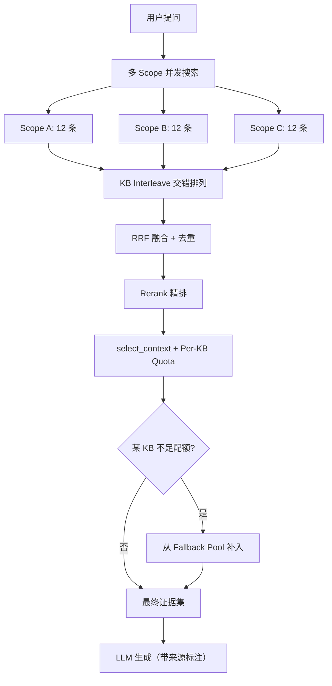

### 修复一：KB Interleave（消除位置偏差）

**问题**：`_search_vector_scopes` 把各 scope 的结果简单拼接——如果 scope 顺序是 `[A, B, C]`，拼接后前 12 条全是 A 的。下游 `run_search_channels` 的 round-robin bounding（`max_candidates=40`，3 channel 各取 ~13 条）会系统性地让 A 占满名额。

**方案**：搜索完成后，按 `kb_id` 分组，做 Round-Robin 交错排列：

```text
拼接结果:  [A1, A2, ..., A12, B1, ..., B12, C1, ..., C12]

Interleave: [A1, B1, C1, A2, B2, C2, A3, B3, C3, ...]
```

这样无论下游怎么截断，每个 KB 在前 N 位中都有均匀代表。

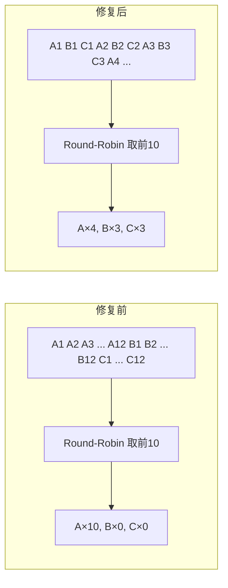

**守卫条件**：`len(scopes) > 1` 时才执行 interleave，单库查询完全跳过，不影响原有行为。

### 修复二：Per-KB 配额（Swap-Based Quota）

**问题**：即使 interleave 后进入 Reranker 的候选是均匀的，Reranker 按分数排序后，高分库仍可能占据全部 `final_top_k` 个位置。

**方案**：在 `select_context` 中引入 Per-KB 最低配额：

```text
final_top_k = 20, kb_min_quota = 2, 共 3 个 KB

Rerank 后: A×16, B×3, C×1
配额检查: C 不足 2 条 → 从 A 踢出最低分 1 条，换入 C 的次优 1 条
最终:    A×15, B×3, C×2
```

核心规则：
- 只从**超过配额**的 KB 中踢出最低分条目
- 换入的条目来自该 KB 的**未入选最高分**候选
- 如果 Rerank 后候选不够，从 `fallback_pool`（pre-rerank 完整候选池）补入
- 配额默认 2 条，可通过 `RETRIEVAL_KB_MIN_QUOTA` 配置

**守卫条件**：`RETRIEVAL_KB_QUOTA_ENABLED=true` 且 `len(retrieval_scopes) > 1` 且 `len(all_kbs) > 1`。

### 修复三：Fallback Pool（配额补入池）

**问题**：Reranker 只返回 top-K 条结果。如果某个 KB 的所有文档在 Rerank 后都被截断了（分数不够进入 top-K），配额机制"无米下锅"。

**方案**：把 Rerank 前的去重候选池（`deduped`）作为 `fallback_pool` 传入 `select_context`。当某 KB 在 Reranked 结果中不足配额时，从 fallback_pool 中按该 KB 过滤并补入：

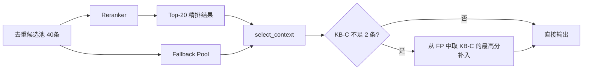

### 修复四：来源归因标注

**问题**：LLM 看到的上下文是 `[来源 1] 内容...`，不知道这段内容来自哪个知识库、哪篇文档。用户问"huamulan-agent 怎么用"，LLM 即使拿到了 huamulan-agent 的文档，也无法在回答中正确归因。

**方案**：在 context_chunks 构建时注入 `kbId`、`kbName`、`docName`，并在 prompt 格式化时展示：

```text
[来源 1] (知识库: huamulan-agent | 文档: Harness使用指南.md)
Harness 是一个 CI/CD 平台，支持...

---

[来源 2] (知识库: flavor-code | 文档: 部署手册.md)
部署前需要配置...
```

LLM 现在可以明确说出"根据 huamulan-agent 知识库中的 Harness 使用指南..."。

### 修复五：Rewrite / Intent 超时降级

查询改写和意图识别是 LLM 调用，可能因网络波动超时。v0.0.8 为两者添加了独立的 try/except 降级：

- **改写超时/失败**：回退到原始查询，不阻塞检索
- **意图识别超时/失败**：回退到 `general` 通用意图，所有通道正常检索

这保证了即使 LLM 服务短暂不可用，检索链路仍能正常运行。

### 配置

```dotenv
# === 跨库公平召回 (v0.0.8 新增) ===
RETRIEVAL_KB_QUOTA_ENABLED=true        # 启用 Per-KB 配额
RETRIEVAL_KB_MIN_QUOTA=2               # 每个 KB 最低保障条数
RETRIEVAL_FINAL_TOP_K=20               # 最终证据条数（从10调至20）
RETRIEVAL_CONTEXT_MAX_TOKENS=12000     # 上下文 token 预算
RETRIEVAL_CONTEXT_MAX_CHARS=24000      # 上下文字符预算
LLM_CONTEXT_WINDOW_TOKENS=32768        # LLM 窗口（从8192调至32768）
```

### 单知识库兼容性

所有新增逻辑都有严格的多 KB 守卫：

| 修改点 | 守卫条件 | 单 KB 行为 |
|--------|----------|------------|
| KB Interleave | `len(scopes) > 1` | 跳过，原样返回 |
| Per-KB Quota | `len(retrieval_scopes) > 1` 且 `len(all_kbs) > 1` | 不执行 |
| Fallback Pool | `kb_quota` 非 None | 不传入 |
| 来源标注 | `kbName` 非空 | 回退到 `[来源 N]` 无标注 |

单库查询走的仍是原来的纯分数排序 → Rerank → select_context 路径，零影响。

### 0.0.8 实现矩阵

| 范围 | 覆盖 |
|---|---|
| 位置偏差 | vector/keyword/graph 三路 scope 搜索均使用 `_interleave_by_kb` |
| 配额保障 | 并行路径和顺序路径均传入 `kb_quota` + `fallback_pool` |
| 来源归因 | context_chunks 含 kbId/kbName/docName；prompt 格式化展示知识库和文档名 |
| 降级容错 | rewrite/intent 超时或异常时回退到原始查询 + general 意图 |
| 兼容性 | 单 KB 查询全路径无行为变化 |

---

## v0.0.7 可信语义知识图谱

### 先用一句话讲明白

旧方案像“看通讯录找同名”：A 库和 B 库都出现 `GraphRAG`，系统就认为它们可能在谈同一个对象。这个方法稳定、便宜、可解释，但如果两个库都出现 `JSON` 或 `API`，这样的“同名”几乎没有意义。

新方案像“先读句子，再记关系”：

> 原文写着“GraphRAG 使用 Neo4j 存储知识图谱”，轻量 LLM 可以提出
> `GraphRAG -[STORES_IN]-> Neo4j`。但系统只有在实体和证据都能在原 chunk
> 中找到、关系类型合法、置信度达到阈值时才会入图。

LLM 不是图谱的最终裁判，只是候选关系提取器。服务端校验和原文证据才是入图门槛。

### 为什么不再只用名称

只用名称有两类问题：

1. **假关联**：`JSON`、`API`、`HTTP` 等通用词在很多文档中都会出现，但它们不能说明两个知识库有业务联系。
2. **缺少方向和含义**：同名边只能说明“可能是同一个东西”，无法表达“服务 A 调用 API B”或“组件 C 依赖模型 D”。

v0.0.7 保留名称桥作为高精度身份锚点，同时新增带方向、有类型、有证据的
`SEMANTIC_RELATED`。`JSON`、`API`、`HTTP`、`HTTPS`、`XML`、`YAML`
被列入跨库名称桥停用词；它们仍可作为文档内部实体出现，但不会仅凭同名连接两个库。

### 三层图谱

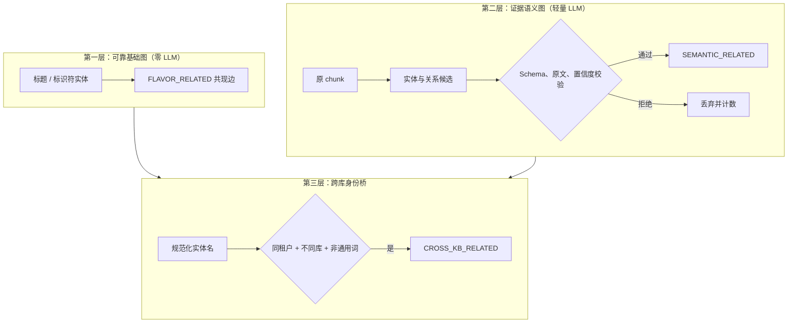

三层各有明确职责：

| 层 | 回答的问题 | 模型失败时 |
|---|---|---|
| 基础图 | 文档里有哪些稳定可识别的节点，哪些节点在同一 chunk 出现 | 不受影响 |
| 语义图 | 谁使用谁、依赖谁、实现谁、属于谁 | 本次增强跳过，基础图继续可用 |
| 跨库桥 | 两个库里是否存在值得对齐的同一实体 | 继续使用确定性规则 |

这里没有让 LLM 两两比较所有知识库。那会随文档数量近似平方增长，成本高，也更容易产生无法证明的边。跨库路径由“文档内有证据的语义边 + 跨库高质量实体锚点”组成。例如：

```text
A 库：订单服务 -[USES]-> Kafka
                         ||
                         || CROSS_KB_RELATED（同一 Kafka 实体）
                         ||
B 库：Kafka -[PART_OF]-> 消息平台
```

这样能说明两个库通过 `Kafka` 发生联系；仅仅都出现 `JSON` 则不会产生跨库桥。

### 抽取与可信度门槛

轻量模型使用温度 `0`，只允许输出固定 JSON。允许的关系类型为：

```text
USES, DEPENDS_ON, IMPLEMENTS, PART_OF, EXPOSES, PRODUCES, CONSUMES,
STORES_IN, EVALUATED_ON, COMPARED_WITH, EXTENDS, INTEGRATES_WITH
```

服务端不会直接信任模型输出，而是逐条检查：

1. `source` 和 `target` 必须都是本次已验证实体；
2. 实体名称必须逐字出现在输入文档；
3. `chunk_id` 必须属于本次文档；
4. `evidence` 必须是该 chunk 中真实存在的原文片段；
5. 关系类型必须在白名单；
6. `confidence >= GRAPH_SEMANTIC_MIN_CONFIDENCE`，默认 `0.70`；
7. 同一关系重复输出只保留一次。

每条入库边保存：

| 字段 | 用途 |
|---|---|
| `relation_type` | 关系含义和方向 |
| `description` | 简短可读说明 |
| `confidence` | 模型置信度 |
| `evidence` | 支持关系的原文 |
| `chunk_id / doc_id / kb_id / tenant_id` | 完整来源定位 |
| `model / prompt_version` | 可复现、可回滚 |
| `evidence_id` | 幂等键，避免重试生成重复边 |

前端选中节点后会展示关系类型、置信度和证据。用户看到的不再只是“有一条线”，而是能判断“这条线为什么存在”。

### 新增、修改、删除如何自动维护

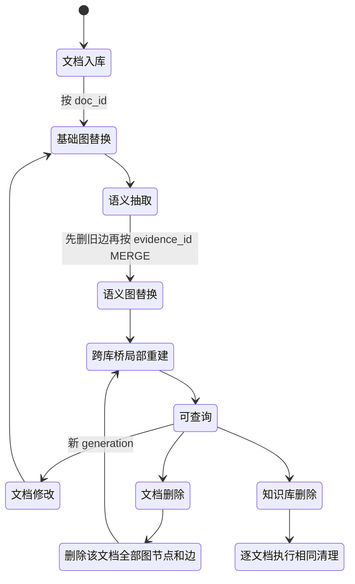

- **新增知识库**：空知识库没有可抽取内容；第一篇文档正常入库时自动建图，不需要额外初始化。
- **新增文档**：现有摄取流程写完 chunks 后，依次写基础图、证据语义图，并维护受影响的跨库实体。
- **修改文档**：按 `doc_id` 替换旧基础节点；删除旧 `SEMANTIC_RELATED` 和仅由语义抽取得到的节点，再写入新结果，因此可安全重试。
- **删除文档**：`IndexSyncService` 从 Neo4j 删除该文档全部节点和附着关系，随后只重建受影响的跨库名称组；LightRAG 也执行对应删除。
- **删除知识库**：知识库删除接口逐篇调用同一清理流程，所以不会留下孤儿语义边。
- **抽取失败**：记录 `semantic_graph_enrichment_failed`，基础图和 LightRAG 仍继续，并创建
  Graph repair job；repair worker 会按退避策略重跑“基础图 + 语义图 + LightRAG”。不会因为
  增强模型短暂不可用而丢失文档索引。

### 历史知识库是否要重建

**不用新建知识库，也不用重新 chunk，更不用重做 Embedding。**

历史升级分两步：

```bash
cd flavorag-server

# 1. 名称字段和跨库锚点：先预演，再写入
python -m app.rag.graph.backfill
python -m app.rag.graph.backfill --apply

# 2. 语义关系：直接读取 PostgreSQL 中现有 active chunks
python -m app.rag.graph.semantic_backfill
python -m app.rag.graph.semantic_backfill --apply --concurrency 2
```

第二个命令默认只统计将处理多少文档和 chunks；只有显式传入 `--apply` 才调用
LLM 并写 Neo4j。可以用 `--kb-id`、`--doc-id`、`--limit` 小范围抽样，确认质量和成本后再全量执行。

### 配置

```dotenv
GRAPH_ENABLED=true
GRAPH_SEMANTIC_ENABLED=true
GRAPH_SEMANTIC_MODEL=qwen-plus-latest
GRAPH_SEMANTIC_BASE_URL=
GRAPH_SEMANTIC_API_KEY=
GRAPH_SEMANTIC_TEMPERATURE=0
GRAPH_SEMANTIC_MAX_TOKENS=2048
GRAPH_SEMANTIC_MAX_INPUT_CHARS=4000
GRAPH_SEMANTIC_BATCH_CHUNKS=6
GRAPH_SEMANTIC_MAX_ENTITIES_PER_BATCH=12
GRAPH_SEMANTIC_MAX_RELATIONSHIPS_PER_BATCH=16
GRAPH_SEMANTIC_TIMEOUT_SEC=45
GRAPH_SEMANTIC_MIN_CONFIDENCE=0.70
GRAPH_SEMANTIC_MAX_ENTITY_NAME_CHARS=120
GRAPH_SEMANTIC_MAX_DESCRIPTION_CHARS=360
GRAPH_SEMANTIC_MIN_EVIDENCE_CHARS=8
GRAPH_SEMANTIC_MAX_EVIDENCE_CHARS=600
GRAPH_SEMANTIC_REQUIRE_ENDPOINTS_IN_EVIDENCE=true
GRAPH_SEMANTIC_REJECT_NEGATIVE_STORES=true
GRAPH_SEMANTIC_VALIDATE_PART_OF_DIRECTION=true
GRAPH_SEMANTIC_PROVIDER_FALLBACK_ENABLED=true
GRAPH_SEMANTIC_BACKFILL_CONCURRENCY=2
```

`BASE_URL` 和 `API_KEY` 留空时复用主 LLM 的 OpenAI-compatible 配置。生产上先用少量文档回填并人工核验；如果假边偏多，提高置信度阈值，如果漏边明显，再调整 prompt 或选择更强的抽取模型。

长文档按 `GRAPH_SEMANTIC_MAX_INPUT_CHARS` 和 `GRAPH_SEMANTIC_BATCH_CHUNKS`
切成有界抽取批次，所有批次验证成功后才一次性替换该文档语义图，避免半成品。如果主语义
provider 返回鉴权/模型错误，会按“百炼 → HyDE → Mem0 → reasoning”的已配置兼容端点
降级；模型名、Key 和 Base URL 始终成组切换，禁止把 A 厂商的 Key 拼到 B 厂商端点。

超参数分为三组：

| 分组 | 参数 | 安全边界 |
|---|---|---|
| 模型调用 | `TEMPERATURE`、`MAX_TOKENS`、`TIMEOUT_SEC` | 温度 `0..2`；输出 `256..8192` tokens；超时至少 1 秒 |
| 批次与密度 | `MAX_INPUT_CHARS`、`BATCH_CHUNKS`、`MAX_ENTITIES_PER_BATCH`、`MAX_RELATIONSHIPS_PER_BATCH` | batch chunks `1..50`；实体 `1..100`；关系 `1..200` |
| 质量门槛 | `MIN_CONFIDENCE`、名称/说明/证据长度、三个严格校验开关 | 置信度收敛到 `0..1`；证据长度 `1..2000` |
| 运行策略 | `PROVIDER_FALLBACK_ENABLED`、`BACKFILL_CONCURRENCY` | 回填并发 `1..8` |

关系类型集合属于图谱 schema，不作为普通环境变量开放。若任意字符串都能变成关系类型，
同义词和拼写差异会让图谱再次失控。需要增加关系类型时，应同时修改 schema、prompt、校验
和测试。

### 业内方案依据

本方案不是单纯把名称匹配替换成 LLM，而是采用常见的混合路线：

- [Microsoft GraphRAG Methods](https://microsoft.github.io/graphrag/index/methods/)：标准流程使用 LLM 做实体、关系和摘要抽取；
- [Microsoft GraphRAG Outputs](https://microsoft.github.io/graphrag/index/outputs/)：关系保留描述、权重和来源 text unit，并支持增量合并；
- [Microsoft GraphRAG CLI](https://microsoft.github.io/graphrag/cli/)：提供 update 工作流；
- [Neo4j GraphRAG Knowledge Graph Builder](https://neo4j.com/docs/neo4j-graphrag-python/current/user_guide_kg_builder.html)：管线包含 schema、实体关系抽取、剪枝、写入和实体解析；
- [LightRAG Core](https://github.com/HKUDS/LightRAG/blob/main/docs/ProgramingWithCore.md)：增量插入和按文档删除会更新仍被其他文档支持的实体与关系。

Flavor-RAG 在这些思路上增加了更严格的原文子串校验和确定性降级层，目的是让图谱既能自动增长，又能解释和回滚。

### 0.0.7 实现与测试矩阵

| 范围 | 覆盖 |
|---|---|
| 抽取 | fenced JSON、固定 schema、零温度、分块来源 |
| 反幻觉 | 原文不存在的实体、伪造证据、非法关系类型被拒绝 |
| 弱关系 | 低置信边被拒绝；`JSON/API/HTTP/XML/YAML` 不可作为名称型跨库桥 |
| 幂等更新 | 旧语义边先删除，关系按 `evidence_id` MERGE，基础节点保留来源标记 |
| 生命周期 | 新增自动抽取、修改按文档替换、删除 detach 并局部重建跨库桥、知识库逐文档清理 |
| 降级 | 语义模型失败时基础 Neo4j 图和 LightRAG 流程继续 |
| 展示 | 图 API 返回语义类型、说明、置信度、证据和模型；前端节点详情可见 |
| 回填 | 现有 active chunks 按文档分组，不触发重新分块或向量化 |

真实数据质量探针（2026-07-28）使用 `flavor-code` 中一篇 19-chunk 文档：

- 服务端最终保留 38 个实体、1 条关系，拒绝 62 项不满足实体/证据/方向门槛的候选；
- 保留关系为 `flavor-code -[IMPLEMENTS, 0.95]-> Harness`，证据原文随边存储；
- `Harness` 已通过既有 `CROSS_KB_RELATED` 对齐到 `huamulan-agent` 库中的
  `Harness`，因此形成了可解释的跨库路径；
- 加严前曾出现“删除 secret”被误标为 `STORES_IN`，新增端点同句、否定语义和方向校验后
  已被替换清除，矛盾 `STORES_IN` 边计数为 0；
- 当前 Neo4j 实际存在 326 条确定性跨库桥和 1 条试点语义边。历史语义全量回填应按运维
  手册先抽样、留存 `rejected` 比例，再逐库执行。

## v0.0.6 跨知识库 Graph RAG

本版本以 [跨知识库 Graph RAG SDD](docs/specs/cross-knowledge-base-graph-rag.md) 为规格并按 TDD 实现。`*` 是唯一的全库范围标识；服务端将它解析为当前 principal 可读的知识库集合，外部索引只负责过量召回，PostgreSQL 负责最终 fail-closed 权限过滤。

### 0.0.6 实现矩阵

| 能力 | 实现 |
|---|---|
| 全库范围 | 桌面与移动端选择器新增“全部知识库”，请求使用 `kb_id=*`；`null` 保留旧语义 |
| 权限解析 | `resolve_chat_kb_scopes` 通过 `kb_access_predicate(READ)` 解析精确 KB 集合和 active collection/embedding model |
| 多库检索 | Vector、BM25、Neo4j、LightRAG 对 query × scope fan-out，随后统一 RRF、去重、Rerank 与上下文预算 |
| ACL 闭环 | PostgreSQL 对候选 chunk 执行 tenant、KB 集合、document ACL、enabled、deleted 二次过滤 |
| Graph 强制 | 前端全库模式锁定开关；服务端 `effective_graph_rag` 对 `kb_id=*` 始终返回 true |
| 跨库关系 | 实体持久化 `tenant_id + normalized_name + cross_linkable`；同租户不同库的有效同名实体按 KB 对写入一条代表性 `CROSS_KB_RELATED` |
| 图数据迁移 | `python -m app.rag.graph.backfill` 只读预演，增加 `--apply` 原地回填旧 Neo4j 节点并重建跨库边；不重新 chunk、Embedding 或创建知识库 |
| 图谱容量 | 单库最多 200 节点；全库按规范化实体类型分别最多 200 节点，并返回 `truncatedByType/typeStats` |
| 知识星图 | 按知识库与实体类型布局；总览层聚合为“知识库 × 类型”星团，详情层执行视口 + 90 world-unit overscan 裁剪并最多绘制 420 节点；来源图例、跨库虚线桥、拖拽和指针锚定缩放保留 |
| 召回动效 | Graph 通道 `count > 0` 时记录查询并触发连通路径光流/节点呼吸；尊重 reduced-motion |
| 知识库创建可靠性 | 前端未选模型时省略 `embedding_model`；服务端使用 `EMBEDDING_MODEL` 默认值并将旧简写 `qwen3-embedding-8b` 规范化为 provider-qualified 模型名 |
| 验证 | 后端 207 项全量测试、前端 12 项单测、TypeScript、Vite 生产构建；真实全库 API 返回 333 节点/1359 边并完成桌面语义缩放、聚合与详情降噪 QA |

### 跨库检索数据流

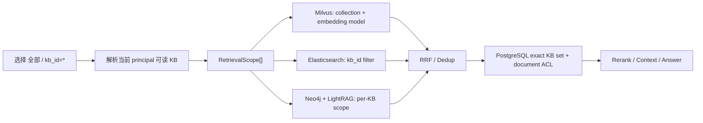

---

## v0.0.5 企业级 RAG 数据面加固

本版本以 [0.0.5 SDD](docs/0.0.5-enterprise-rag-sdd.md) 为规格，以失败测试驱动实现。企业级结论仅覆盖知识摄取、索引、检索、生成、引用、评测、可观测性与部署恢复，不包含登录和权限体系。

### 设计不变量

1. PostgreSQL 是业务事实源；Milvus、Elasticsearch 和图索引是可重建投影。
2. embedding 维度不匹配必须显式失败，任何代码路径不得自动删除 active collection。
3. 文档新 generation 只有在 Milvus 和全部 required channel 成功后才激活；失败时旧 generation 继续服务。
4. 所有长任务必须持久化，可在请求进程或 worker 崩溃后恢复；多副本不得重复领取。
5. evidence、memory 和 profile 都是不可信输入，不得覆盖 system instruction。
6. SSE 增量显示、finish `fullAnswer` 和数据库持久化答案必须一致。
7. 离线评测必须绑定 corpus/index/document/prompt/model 版本，并同时覆盖 retrieval 和最终 answer。

### 0.0.5 实现矩阵

| 能力 | 实现 |
|---|---|
| 非破坏索引 | `KnowledgeIndexGeneration` 记录模型、维度、parser/chunker 版本和状态；新物理 collection 构建、精确数量校验后 promotion；retired/failed generation 延迟 7 天清理 |
| 摄取一致性 | `IngestionJob.idempotency_key` 去重；chunk 与 PDF asset 均使用 `generation + index_status`；required channel 成功前保持 `PENDING` |
| 索引修复 | `IndexRepairJob` 支持 Milvus/Elasticsearch/Graph，指数退避和 DEAD；reconciliation 定期检测缺失 active chunk 与孤儿向量 |
| 共享源存储 | 生产 Compose 使用 S3/RustFS；worker 按需 materialize 临时文件；本地磁盘仅作为开发回退 |
| 定时刷新 | 两套 URL/document refresh 均改为 pending generation，不再先删除旧 chunk |
| 检索治理 | 推测结果必须同时匹配最终 query 和 collection；HyDE 顺序/并行语义一致；通道异常进入 breaker/metrics；分数域独立阈值 |
| Token 预算 | 混合中英文 token 估算；限制问题和 history；为 system、memory、profile、输出预留后再分配 evidence |
| 生成安全 | 检索材料按不可信 evidence 注入；生成总超时和最大输出；客户端断开传播取消；记忆只提取用户消息 |
| 引用协议 | 校验 `[N]` 范围及引用句与 evidence 的支持关系；finish 返回规范化 `fullAnswer`，前端覆盖增量内容 |
| 文档安全 | 文件大小、批次数、MIME/签名、PDF 页数、ZIP 展开量/条目/压缩比/加密、图片像素、OCR/VLM 并发均有硬上限 |
| 持久化任务 | 单文档摄取、批量导入、评测、索引构建使用数据库任务；`SKIP LOCKED` 或 advisory lock 支持多副本与 lease 恢复 |
| 企业评测 | Recall/NDCG/MRR、拒答、稳定性、answer quality、citation、注入 canary、最小样本、reference coverage 与 95% CI |
| 可观测性 | 完整流式 HTTP latency、RAG E2E、token、空召回、拒答、引用、索引漂移、repair、queue 指标；Prometheus 告警和 Grafana 面板 |
| 生产部署 | `uv.lock`/`package-lock.json`；容器自动 migration、无 reload、多 worker；liveness/readiness 分离；空 PostgreSQL 单命令升级 |

### 后台状态机

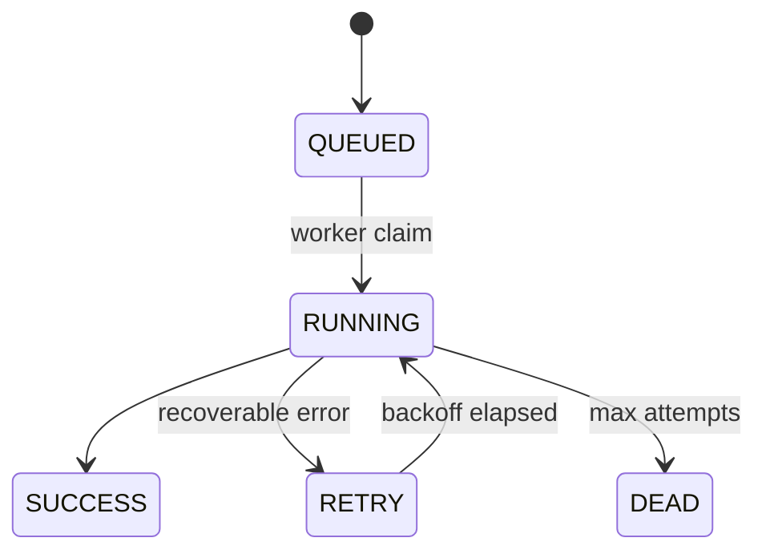

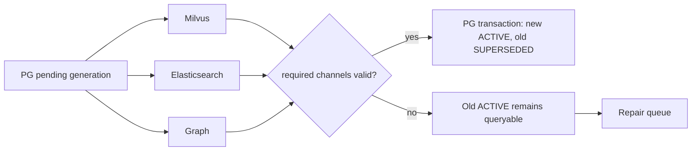

### 评测可解释性

每次运行在 `config_json` 固化 `corpus_snapshot`、`index_generation`、`embedding_model` 和 `prompt_version`。固定 expected document 不属于所选知识库、snapshot 或 document generation 不匹配时，API 返回 400，不再把失效 chunk ID 当作零分样本。负反馈只生成待人工复核的 candidate IDs，不能循环地把错误召回自动标成 ground truth。

生成阶段 adversarial case 会把带 canary 的恶意指令作为检索 evidence 送入真实生成调用，并以 `injection_safety` 检查泄漏。缺少 reference answer 时 correctness/completeness 不会伪造通过分，`correctness_reference_coverage` 门禁会明确失败。

### 运维与恢复

完整发布、备份、恢复、索引事故、队列事故和回滚流程见 [运维手册](docs/operations-runbook.md)。推荐把 PostgreSQL 与对象存储作为备份核心，Milvus/Elasticsearch/Graph 作为可重建且可快照加速恢复的投影。

---

## 目录

1. [系统总览](#1-系统总览)
2. [分块逻辑](#2-分块逻辑)
3. [召回逻辑](#3-召回逻辑)
4. [HyDE 假设文档嵌入](#4-hyde-假设文档嵌入)
5. [评测体系](#5-评测体系)
6. [可观测性](#6-可观测性)
7. [Graph RAG](#7-graph-rag)
8. [Agentic RAG](#8-agentic-rag)
9. [批量导入与文档去重](#9-批量导入与文档去重)
10. [异步摄取与增量索引](#10-异步摄取与增量索引)
11. [系统监控与健康检查](#11-系统监控与健康检查)
12. [Mem0 长期记忆与用户画像](#12-mem0-长期记忆与用户画像)
13. [附录：配置速查](#13-附录配置速查)

---

## 1. 系统总览

### 1.1 定位

Flavor-RAG 是一个面向企业的 RAG（Retrieval-Augmented Generation）智能问答系统。它采用 **Python FastAPI + React** 技术栈，完整覆盖从文档入库到智能问答的全链路。核心思路是：**先把企业文档变成可检索的"知识块"，再用多路检索 + 重排序从这些块里找到最相关的内容，最后交给大模型生成可信回答。**

### 1.2 核心流程

一句话概括：**用户提问 → 问题改写 → 意图识别 → HyDE 假设文档生成（可选）→ 多路并行检索（含 HyDE 向量通道）→ RRF 融合 → 去重 → 近邻补偿 → Rerank 重排序 → 大模型生成回答 → 返回带来源引用（含图片/表格）的答案。**

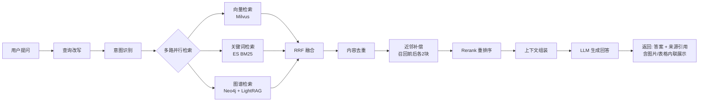

### 1.3 技术栈一览

| 层次 | 技术选型 | 用途 |
|------|---------|------|
| Web 框架 | FastAPI (Python 3.11+) | REST/SSE 服务 |
| 前端 | React + Vite + TypeScript | 管理后台 + 问答界面 |
| 关系数据库 | PostgreSQL + SQLAlchemy | 元数据、会话、链路追踪 |
| 向量数据库 | Milvus (IVF_FLAT + Cosine) | 语义向量检索 |
| 关键词检索引擎 | Elasticsearch (BM25) | 关键词全文检索 |
| 图数据库 | Neo4j + LightRAG | 实体关系图谱 |
| 缓存/限流 | Redis | 滑动窗口限流 |
| 对象存储 | RustFS (S3 兼容) | PDF 图片/附件存储 |
| 嵌入模型 | Qwen3-Embedding-8B (4096维) | 文本向量化 |
| 重排序模型 | Qwen3-Reranker-8B | 召回结果精排 |
| LLM | Qwen-Plus / DeepSeek-V3 | 回答生成 |
| 可观测性 | Prometheus + OpenTelemetry + Jaeger | 指标 + 链路追踪 |

### 1.4 v0.0.2 更新摘要

相对于 v0.0.1，本版本主要新增：

- **批量导入与去重**：多文件上传 + SHA-256/语义双重去重
- **异步摄取队列**：Outbox 模式 + Worker + 指数退避重试 + 死信
- **增量索引**：变更检测，仅重建变化文档
- **分块增强**：块类型元数据、表格双文本嵌入
- **系统监控面板**：RAG 指标/摄取队列/时序图表
- **可观测性升级**：15 个 Prometheus 指标含 TTFT
- **来源媒体展示**：图片/表格内联渲染
- **403 全局提示**：权限不足 Toast

### 1.5 v0.0.3 更新摘要

相对于 v0.0.2，本版本主要新增：

- **HyDE 假设文档嵌入**：轻量 LLM 生成假设文档 → 向量化 → 额外检索通道，桥接 query-document 语义鸿沟，提升短查询/模糊查询召回率
- **HyDE 前端交互**：问答输入框 HyDE 开关按钮、假设文档可折叠展示、超时/降级状态提示、检索通道归因标签
- **HyDE 治理**：独立 Circuit Breaker 熔断、可配置 RRF 融合权重（默认 0.8）、15s 超时自动降级、MockLLMClient 测试环境自动跳过

### 1.6 v0.0.4 更新摘要

相对于 v0.0.3，本版本主要新增：

- **Mem0 长期记忆层**：基于 Milvus 向量存储 + DeepSeek-V4-Flash 事实提取 + Qwen3-Embedding-8B 向量化的完整 mem0 模式实现，支持从对话中自动提取用户事实、智能去重（ADD/UPDATE/NOOP）、更新已有记忆（冲突解决）
- **混合记忆检索**：向量（Milvus COSINE）+ 关键词（ES BM25）双通道召回，加权融合排序（默认 0.7:0.3），自动注入生成 Prompt
- **七维用户画像**：由行为统计（意图分布、知识库偏好、查询风格、反馈信号）+ LLM 领域提取 + mem0 事实计数聚合而成，支持增量更新和每日定时全量重建
- **画像驱动 RAG**：对话前拉取用户画像和相关记忆注入 System Prompt，对话后异步提取新记忆 + 更新画像
- **管理后台**：新增用户画像管理页面（`UserProfilePage`），支持画像查看、重建、记忆事实浏览/删除、配置热更新

---

## 2. 分块逻辑

分块（Chunking）是 RAG 系统最基础也是最关键的一步。分得太粗，检索精度差；分得太细，语义碎片化。Flavor-RAG 提供**三种分块策略**，支持从不同文档类型中自动选择最优方式。

### 2.1 三种分块策略对比

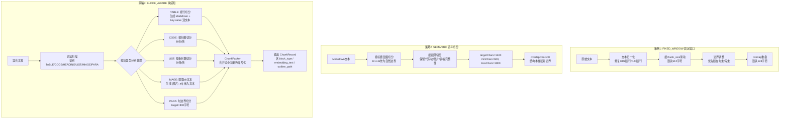

**一句话总结**：FIXED_WINDOW 最简单粗暴、兼容性最好；SEMANTIC 适合格式规范的 Markdown；BLOCK_AWARE 最智能，能区分表格/代码/列表/段落分别处理，并生成块类型元数据和双文本嵌入。

### 2.2 FIXED_WINDOW 详解

核心参数：
- `chunk_size`: 块大小，默认 512 字符
- `overlap_size`: 重叠大小，默认 128 字符（即相邻块之间共享 128 字符，防止关键信息被切断）

边界调整逻辑（`_adjust_to_boundary`）按优先级从高到低：
1. **换行符 `\n`**：优先在段末断开
2. **中文句末标点**：`。！？`
3. **英文句末标点**：`. ! ?`（需后跟空格或行尾）

文本归一化（`_normalize_text`）处理了两个常见坑：
- **URL 断行修复**：文档中 URL 被换行切断（如 `https://example.com\n/path`），会自动合并回一行
- **CJK 行中断行**：中文文本中插入的无意义换行（前后都是 CJK 字符），自动移除

### 2.3 SEMANTIC 详解

专为 Markdown 设计，利用结构信息做自然切分：
- 以标题（`#` ~ `######`）作为自然分段边界
- 保留代码块（`` ``` ``）、表格、图片的完整性
- 段落按 `targetChars=1400`、`minChars=600`、`maxChars=1800` 控制大小
- 不设字符级 overlap，因为标题层级本身就是上下文

### 2.4 BLOCK_AWARE 详解（推荐用于混合文档）

这是最精细的策略。首先通过**词法扫描器**将文档解析为不同类型的块（Block），然后每种类型有独立的切分逻辑：

| 块类型 | 识别方式 | 切分策略 | 特殊处理 |
|--------|---------|---------|---------|
| TABLE | `\|...\|` 行模式 | 按行切分，每批 20 行 | **生成双文本**：Markdown 原始表格（人类可读） + `col: value` 键值对（嵌入优化） |
| CODE | ` ``` ` 围栏 | 按行切分，每批 80 行 | 保持代码完整性 |
| HEADING | `#` 开头行 | 作为 outline_path 前缀，不单独切分 | 挂载到后续段落 |
| LIST | `- / * / 1.` 开头 | 按条目数切分，每批 30 条 | 小列表保持完整 |
| IMAGE | `` | 提取 alt 文本 | content 保留原始 Markdown，embedding_text 生成 `[图片: alt]` |
| PARA | 其他文本 | 句边界切分，target=800 | 优先断在句号/换行 |

**块类型元数据（v0.0.2 新增）**：每个 ChunkRecord 包含三个新字段：

| 字段 | 用途 |
|------|------|
| `block_type` | 来源块类型：`TABLE` / `CODE` / `LIST` / `IMAGE` / `PARAGRAPH` / `HEADING` |
| `embedding_text` | 检索优化的嵌入文本（为空时用 content 作为嵌入文本） |
| `outline_path` | 从文档根到此块的标题路径，如 `["概述", "安装步骤"]` |

**表格双文本嵌入（v0.0.2 新增）**：这是 BLOCK_AWARE 策略的一大亮点。传统分块把 Markdown 表格原样嵌入向量库，但嵌入模型对 `| 列1 | 列2 |` 这种表格语法不敏感——它无法理解"这一列是什么含义"。解决方案是为每个表格块生成两种文本：

- **content**（人类可读）：完整的 Markdown 表头 + 分隔行 + 数据行，原样展示给用户
- **embedding_text**（检索优化）：`headers: 名称, 版本, 描述 \n 名称: Redis; 版本: 7.0; 描述: 内存数据库` —— 用 `col: value` 键值对格式，让嵌入模型直接理解"这一行的每一列分别是什么"

这样当用户搜索 `"Redis版本"` 时，向量检索能以更高精度命中表中的对应行。

切分完成后还有 **ChunkPacker** 步骤：扫描所有块，将字符数小于 `minChars`（默认 300）的相邻小块合并。但 TABLE、CODE、HEADING 等原子块**永不参与合并**——它们本身就是独立语义单元。合并时 buffer 内的多个块会拼接 content 和 embedding_text，outline_path 保留最长公共前缀。

### 2.5 复杂 PDF 分块

对于包含图片、表格的复杂 PDF，系统走专门的 PDF 解析流水线：

```
PDF文件 → pypdfium2提取文字+坐标 → OCR补充低文字区域 → VLM图片理解(可选)
→ pdfplumber提取表格 → 结构化合并 → StructuredPdfChunker分块
```

分块时会保留：
- 页面坐标（`page_start`/`page_end`/`bbox_json`）—— 用于回答中标亮原文位置
- 图片资产的 ID 引用 —— 用于前端展示相关图片

### 2.6 入库流水线

分块只是入库流水线中的一环。完整流程：

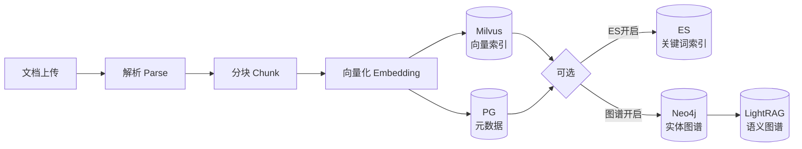

入库过程中的性能指标（解析耗时、分块耗时、嵌入耗时、总耗时）全部写入 `t_knowledge_document_chunk_log` 表，便于后续分析优化。

---

## 3. 召回逻辑

召回是 RAG 系统的心脏。Flavor-RAG 采用 **多路并行检索 + RRF 融合 + Rerank 精排** 的三层架构，从"海选"到"精选"逐步聚焦。

### 3.1 检索前处理：查询改写与意图识别

在真正检索之前，系统先做两件事：查询改写和意图识别。两者在 `RAGPipeline.run()` 中按顺序执行，各自独立且各自有降级兜底——改写失败不影响意图识别，意图识别失败也能走通用默认。

两者的协作关系：

```
原始问题
  → 查询改写: 术语映射 + 正则拆复合 + LLM改写 → 输出 normalized + rewritten + subqueries
  → 意图识别: 拿 subqueries 中的每个子问题做分类 → 输出 IntentResolution(primary + search_channels)
  → 三路检索: 用 rewritten query + 意图指定的 collection + channels
```

---

#### 3.1.1 查询改写（Query Rewrite）— 三层漏斗架构

查询改写不是一步到位的，而是一个**三层漏斗**：第 1 层是数据库驱动的确定性替换（零成本、零延迟、100% 可控），第 2 层是正则拆解复合问题（同样确定性），第 3 层才是 LLM（语义理解、指代消解）。每一层都是独立模块，上层输出是下层输入。

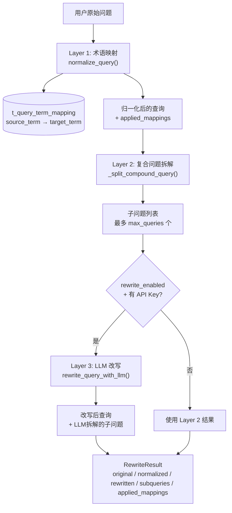

**整体编排**入口函数是 `rewrite_query_result()`，返回一个不可变的数据类 `RewriteResult`，包含五个字段：

| 字段 | 含义 | 来源 |
|------|------|------|
| `original_query` | 用户原始输入（一字不改） | 入参 |
| `normalized_query` | 术语映射 + 空白归一化后的结果 | Layer 1 |
| `rewritten_query` | LLM 改写后的最终查询（无 LLM 时等于 normalized） | Layer 3 或 Layer 1 |
| `subqueries` | 原子子问题列表，用于多路并行检索 | Layer 2 + Layer 3 |
| `applied_mappings` | 实际生效的术语映射记录（可用于前端展示"已将 XX 替换为 YY"） | Layer 1 |

后续检索阶段会优先使用 `rewritten_query` 作为检索文本，同时把 `subqueries` 中的每个子问题分别发给三个检索通道做并发搜索（每个子问题 × 每个通道）。

---

**Layer 1 — 术语映射（Term Mapping）**

这是最基础也最可控的一层，核心思想很简单：**用数据库管理同义词词典，查询时自动替换**。

**数据模型**：表 `t_query_term_mapping`，核心字段：

| 字段 | 说明 |
|------|------|
| `source_term` | 用户常用的词（如 "K8s"、"k8s"） |
| `target_term` | 应该搜的词（如 "Kubernetes"） |
| `mapping_type` | 映射类型（`EXACT` — 精确替换） |
| `kb_id` | 属于哪个知识库（NULL = 全局） |
| `tenant_id` | 租户隔离 |
| `enabled` | 是否启用 |

管理后台有 `QueryTermMappingPage` 页面，管理员可以随时增删改，即时生效（每次查询实时从 DB 读取）。

**加载逻辑**（`load_term_mappings`）：

```python
# 加载条件: enabled=1, deleted=0, tenant_id匹配,
#   kb_id为NULL(全局) OR 匹配当前KB
rows = select(QueryTermMapping).where(
    QueryTermMapping.deleted == 0,
    QueryTermMapping.enabled == 1,
    QueryTermMapping.tenant_id == tenant_id,
    or_(
        QueryTermMapping.kb_id.is_(None),   # 全局映射
        QueryTermMapping.kb_id == "",        # 全局映射(空字符串)
        QueryTermMapping.kb_id == kb_id,     # KB专属映射
    ),
)

# 按 source_term 长度降序排列 — 长词优先
mappings.sort(key=lambda item: len(item["source"]), reverse=True)
```

**为什么按 source 长度降序？** 这是一个容易踩的坑。假设有两个映射："AI" → "人工智能" 和 "AI PC" → "人工智能个人电脑"。如果先执行 "AI" 的替换，会把 "AI PC" 中的 "AI" 部分先替换掉，导致 "AI PC" 这个更长的映射永远无法匹配。按长词优先可以避免这个问题。

**替换逻辑**（`normalize_query`）：

```python
def normalize_query(question, mappings):
    normalized = " ".join(question.split()).strip()  # 合并多余空白

    for mapping in mappings:
        source = mapping["source"]
        target = mapping["target"]
        # 如果目标词已经在文本中，跳过（避免重复替换）
        if target in normalized:
            continue
        # ASCII 词用大小写不敏感匹配；中文词用精确匹配
        flags = re.IGNORECASE if source.isascii() else 0
        pattern = re.escape(source)
        replaced, count = re.subn(pattern, target, normalized, flags=flags)
        if count:
            normalized = replaced
            applied.append({**mapping, "count": count})

    return normalized, applied
```

几个细节：

- **跳过已有目标词**：如果文本中已经包含 `target`（如前一轮替换已命中或用户本来就写对了），不再重复替换。
- **ASCII 词忽略大小写**：`"k8s"` 和 `"K8S"` 和 `"K8s"` 都会被一样的正则匹配到。
- **`re.escape(source)`**：防止 source 中包含特殊正则字符（如 `+`、`.`、`*`）。
- **`re.subn`**：返回替换后的文本和替换次数，替换次数 > 0 才记录到 `applied`。
- **优雅降级**：如果数据库查询失败（比如表还没做迁移），`load_term_mappings` 返回空列表并记一条 warning，不影响主流程。

**术语映射命中统计（v0.0.2 新增）**：每次映射成功命中后，系统会累加 `t_query_term_mapping.hit_count` 计数器。管理后台的 `QueryTermMappingPage` 可以看到每条映射的累计命中次数，帮助管理员评估哪些映射最常用、哪些可能已过时可以禁用。

---

**Layer 2 — 复合问题拆解（Compound Query Splitting）**

这一步同样是确定性的，不需要 LLM。核心函数是 `_split_compound_query`：

```python
def _split_compound_query(question, limit):
    parts = re.split(
        r"(?:[?？；;\n]+|另外|以及|并且|同时|然后|再问|还有)",
        question,
    )
    parts = [p.strip(" ,，;；?？。") for p in parts if p.strip(" ,，;；?？。")]
    return parts[:limit] if len(parts) > 1 else [question]
```

按显式的分隔符和连词拆分复合问题：

- **标点分隔**：`? ？ ； ; \n`
- **连词分隔**：`另外` `以及` `并且` `同时` `然后` `再问` `还有`

例如 `"Redis的缓存策略是什么？另外持久化方式有哪些"` → `["Redis的缓存策略是什么", "持久化方式有哪些"]`。

每个子问题随后会各自走三路检索通道。这样做的好处是：一个包含 3 个子问题的复合查询会向每个通道发 3 次请求，多角度召回，再通过 RRF 融合去重后得到覆盖面更广的候选集。

上限受 `max_queries`（默认 3）约束，避免一个超长复合问题拆成几十个子问题导致检索爆炸。

---

**Layer 3 — LLM 改写（LLM Rewrite）**

Layer 1 和 Layer 2 只能处理显式的词替换和连词拆分，对于**隐含的指代消解、上下文补全、口语转书面语**无能为力。Layer 3 用 LLM 解决这些问题。

**触发条件**（同时满足才执行）：

1. `settings.rewrite_enabled == True`
2. 配置了至少一个 LLM API Key（`bailian_api_key` 或 `siliconflow_api_key`）
3. LLM 客户端不是 MockLLMClient（测试环境跳过）

任一条件不满足 → 直接跳过，使用 Layer 2 的结果。

**函数** `rewrite_query_with_llm` 的核心逻辑：

**历史上下文构建：**

```python
recent = [
    item for item in (history or [])[-6:]
    if item.get("content") and item.get("role") in {"user", "assistant", "system"}
]
history_context = "\n".join(
    f"{item['role']}: {str(item['content'])[:300]}" for item in recent
)
```

取最近 6 条消息（角色在 {user, assistant, system} 中的），每条截断到 300 字符。这样上下文中包含了用户前面问过什么、系统回答过什么，LLM 可以根据这些信息消解"它"、"那个"、"上面说的"等指代词。

**System Prompt：**

```
你负责把对话问题改写成可检索查询。消解指代、补全省略、
把口语转成书面语，但不得添加用户没有表达的事实。
复合问题最多拆成 {max_queries} 个原子问题。
只返回 JSON：{"rewrite":"...","sub_queries":["..."]}
```

关键约束：

- **不得添加用户没有表达的事实**：避免 LLM "脑补"信息，防止改写后的问题偏离原意
- **原子问题**：每个子问题是独立可检索的最小单元
- **JSON 约束输出**：便于程序解析

**User Prompt：**

```
最近对话：
user: ...
assistant: ...
当前问题：{normalized_query}
```

**流式输出与解析：**

```python
tokens = []
async for token in client.chat_stream(prompt, temperature=0.1):
    if not token.startswith("__THINK__"):   # 过滤推理模型的思考过程
        tokens.append(token)

raw = "".join(tokens).strip()
fenced = re.search(r"\{.*\}", raw, re.DOTALL)  # 从响应中提取 JSON
if not fenced:
    return None
payload = json.loads(fenced.group(0))
rewritten = str(payload.get("rewrite") or question).strip()
subqueries = [
    str(item).strip()
    for item in payload.get("sub_queries", [])
    if str(item).strip()
][:max_queries]
```

几个防御性细节：

- **`temperature=0.1`**：极低温度，几乎确定性输出，保证改写结果稳定
- **`__THINK__` 前缀过滤**：DeepSeek 等推理模型在输出 JSON 之前会先输出推理过程，token 以 `__THINK__` 开头。过滤掉这些 token 后才能拿到干净的 JSON
- **正则提取**：`re.search(r"\{.*\}", raw, re.DOTALL)` 从任何可能包含额外文字的输出中提取 JSON 对象
- **兜底**：如果解析失败返回 `None`，上层 `rewrite_query_result` 会 fallback 到 Layer 2 的结果

---

**三层协作示例**

假设用户对话历史：

```
user: 上次说的那个缓存方案是什么来着？
```

这一步在系统中实际执行：

1. **Layer 1 术语映射**：没有匹配的映射 → `normalized = "上次说的那个缓存方案是什么来着？"`
2. **Layer 2 复合拆解**：没有复合连词 → `subqueries = ["上次说的那个缓存方案是什么来着？"]`
3. **Layer 3 LLM 改写**：拿到最近 6 条历史消息，发现其中 user 提到过 Redis → 输出 `{"rewrite": "Redis缓存方案的具体配置和实现方式", "sub_queries": ["Redis缓存方案配置", "Redis缓存实现方式"]}`
4. **最终输出**：`rewritten_query = "Redis缓存方案的具体配置和实现方式"`, `subqueries = ["Redis缓存方案配置", "Redis缓存实现方式"]`

然后检索阶段，两个子问题各走三路通道，共 6 路并发搜索。

---

#### 3.1.2 意图识别（Intent Recognition）

将用户问题路由到正确的知识库和检索策略。支持两种模式：

- **词法匹配（Fallback）**：计算问题中的关键词与意图树节点（名称、描述、示例）的重合度，快但不精准
- **LLM 分类（推荐）**：将候选意图发给 LLM 做语义匹配，返回评分和理由。只保留评分 ≥ `intent_min_score`（0.30）的结果

意图树支持层级结构，例如：
```
ROOT
├── 代码搜索 (→ DeepSeek-V3)
├── 文档问答 (→ Qwen-Plus)
├── 数据查询 (→ SQL Tool)
└── 通用问答
```

每个叶子节点可配置：目标知识库、检索通道（vector/keyword/graph）、Prompt 模板、评分阈值。当 LLM 分类前两名意图接近（差距 ≤ 0.08）且目标不同时，系统会生成引导问题让用户选择。

### 3.2 多路并行检索

检索由 **RAGPipeline** 统一编排，vector/keyword/graph/hyde_vector 四个通道并发执行，受 `RetrievalBudget` 统一约束：

| 参数 | 默认值 | 含义 |
|------|--------|------|
| `per_channel_top_k` | 12 | 每个通道召回数量 |
| `max_candidates` | 40 | 融合后最大候选数 |
| `final_top_k` | 20 | 最终返回给 LLM 的块数 |
| `channel_timeout_ms` | 30000 | 单通道超时 |
| `total_timeout_ms` | 35000 | 全局超时 |
| `context_max_chars` | 12000 | LLM 上下文窗口上限 |

#### 3.2.1 向量检索（Milvus）

```
用户问题 → Embedding模型(Qwen3-Embedding-8B) → 4096维向量
    → Milvus COSINE相似度检索 → Top-K 结果
```

- **索引类型**：IVF_FLAT（`nlist=128`），检索时 `nprobe=16`
- **相似度**：Cosine Similarity
- **集合命名**：`rag_{collection_name}` 前缀隔离不同知识库

#### 3.2.2 关键词检索（Elasticsearch BM25）

```
用户问题 → ES match查询(content字段)
    → bool过滤(kb_id) → BM25评分 → Top-K 结果
```

- 索引名：`rag_keyword_store`
- 查询策略：`match` 查询 + `term` 过滤（按知识库隔离）
- 优雅降级：ES 不可用时返回空列表，不影响向量检索

#### 3.2.3 图谱检索（Neo4j + LightRAG 双通道）

参见 [第 7 节 Graph RAG](#7-graph-rag)。

### 3.3 RRF 融合（Reciprocal Rank Fusion）

RRF 是融合多个排序列表的经典算法，核心公式：

```
RRF_score(d) = Σ ( weight_channel / (k + rank_in_channel) )
```

其中 `k=60`（平滑常数），权重默认 `vector:1.0, keyword:1.0, graph:0.65`。

**为什么用 RRF 而不是简单的分数加权？** 因为不同通道的分数不可直接比较（Milvus 的 Cosine 相似度 vs ES 的 BM25 得分）。RRF 只关心"排名"，天然跨通道可比。

融合后每个结果都记录了 **通道归因**（来自哪些通道、各自的排名和贡献），方便排查"为什么这个块排在前面"。

### 3.4 内容去重

使用 **Jaccard 相似度**（字符级 3-gram）检测近似重复的块。两个块的 3-gram Jaccard 系数 ≥ 0.55 → 保留得分更高的那个。

### 3.5 近邻补偿（Neighbor Expansion）

RAG 的一个经典问题是"块太小丢失上下文"——一个回答可能需要的信息跨越了 3 个连续的块，但检索只命中了中间那个。近邻补偿解决的就是这个问题：

```
命中块的 chunk_index = 5
  → 同时拉取 chunk_index = 3, 4（前2块）和 6, 7（后2块）
  → 按 chunk_index 排序后拼接到 context_chunks 中
```

前后各扩展 2 块，去重后统一送入 Reranker。这样 Reranker 看到的不是一个孤立块，而是一个"上下文窗口"，更准确地判断相关性。

### 3.6 Rerank（重排序）

融合后的候选集（最多 40 个）送入 Cross-Encoder Reranker 做精排：

- 模型：Qwen3-Reranker-8B
- 输入格式：`[query, chunk_content]` 对
- 输出：相关性分数（0~1）
- 启用条件：`RERANKER_ENABLED=true` 且至少配置一个 API Key

Reranker 不是必选项——如果禁用，直接使用 RRF 融合后的排名。还有一个 `passthrough` 策略：当候选数 ≤ `final_top_k` 时完全跳过 Reranker，避免无意义的 API 调用。

### 3.7 上下文组装

Rerank 后的 top-N 块按以下策略组装：

1. **多样性优先**：连续来自同一文档的块最多选 2 个，防止某篇长文档"霸占"上下文窗口
2. **窗口截断**：总字符数超过 `context_max_chars`（12000）时截断
3. **ACL 过滤**：组装时再次检查块的权限，防止跨租户/部门泄露

### 3.8 检索治理

RAGPipeline 内置多层保护：

- **RetrievalBudget**：控制总候选数、最终返回数、上下文字符上限
- **CircuitBreaker**：每个检索通道有独立的熔断器，3 次失败 → 熔断打开（30 秒后进入半开状态尝试恢复）
- **Channel Timeout**：每个通道 `channel_timeout_ms` 超时，防止某个慢通道拖垮整个检索
- **Total Timeout**：全局超时 `total_timeout_ms` 保底

---

## 4. HyDE 假设文档嵌入

> **v0.0.3 新增**。HyDE (Hypothetical Document Embeddings) 用轻量 LLM 为用户问题生成一篇"假设性答案文档"，然后将这篇文档向量化后作为额外的检索通道进入 RRF 融合。它的核心价值在于**桥接 query-document 之间的语义鸿沟**——用户提问往往是短句或口语，而知识库文档是长篇陈述，两者的 embedding 向量在高维空间中天然存在距离。通过先生成一篇"模拟文档"，再把这篇文档嵌入后去检索，可以更准确地找到真正相关的内容。

### 4.1 核心思路

```
传统检索:   用户问题(短句) → Embedding → Milvus 向量检索 → 结果
                                                ↑ 语义鸿沟
HyDE 检索:  用户问题 → LLM 生成假设文档(长文) → Embedding → Milvus 向量检索 → 额外结果
                                                ↑ 假设文档更接近真实文档的语义分布
```

对比两个流程：
- **传统向量检索**：`"哪个数据库适合做缓存？"` → 短问句向量 → 与文档块的余弦相似度匹配。问题是短问句缺少文档中常见的描述性词汇（如"内存存储""高并发""过期策略"），导致语义匹配度不足。
- **HyDE 检索**：同一个问题 → LLM 生成 `"Redis 是一个开源的内存数据结构存储系统，常用作数据库、缓存和消息代理。它支持多种数据结构如字符串、哈希、列表、集合等，并提供持久化、主从复制、集群等高级特性。作为缓存方案，Redis 将数据保存在内存中以实现极高的读写速度..."` → 这篇"假文档"的嵌入向量与真正的技术文档在同一语义空间，检索精度显著提升。

**适用场景**：
- 用户输入极短（< 10 个字），如"怎么做缓存？"
- 模糊查询，如"上次说的那个方案"
- 查询术语与文档术语不匹配（用户说"去重"，文档写"重复检测"）

**不适用场景**：
- 查询本身已经很具体、很长（> 50 字），语义差较小
- 实时性要求极高的场景（HyDE 多一次 LLM 调用的延迟）
- 需要精确匹配关键词的场景（BM25 更适合）

### 4.2 实现架构

HyDE 由 `app/rag/hyde.py` 独立模块实现，与改写、意图识别并行执行（TTFT 优化模式下），不阻塞主检索链路。

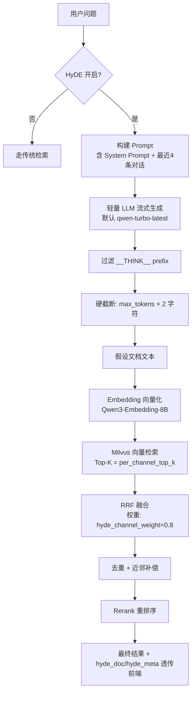

**并行执行策略**：在 TTFT 优化路径（`_run_parallel`）中，HyDE 生成与改写（rewrite）、意图识别（intent）三个任务同时启动。三者互不依赖，谁先完成都不影响其他任务的运行。HyDE 自身有 15s 超时独立控制，超时后仅跳过 hyde_vector 通道，不影响其他通道的检索。

### 4.3 配置参数

| 参数 | 默认值 | 说明 |
|------|--------|------|
| `hyde_enabled` | `false` | 全局默认开关（前端可逐请求覆盖） |
| `hyde_model` | `qwen-turbo-latest` | 轻量模型，专用于生成假设文档 |
| `hyde_base_url` | `""` | 为空时复用 `llm_base_url` |
| `hyde_api_key` | `""` | 为空时复用 `bailian_api_key` / `siliconflow_api_key` |
| `hyde_max_tokens` | `512` | 假设文档最大 token 数 |
| `hyde_temperature` | `0.7` | 生成温度（略高以增加多样性） |
| `hyde_channel_weight` | `0.8` | HyDE 通道在 RRF 融合中的权重 |
| `hyde_timeout_sec` | `15.0` | 单次 HyDE 生成超时 |

### 4.4 System Prompt 设计

HyDE 的 system prompt 精心设计以确保生成的假设文档质量：

```
你是一个知识检索助手。给定用户的问题，请写出一段可能包含答案的文档片段。
要求：
1. 以陈述句撰写，模拟真实文档的语气和结构
2. 包含具体的事实、数据或步骤（可以合理推测）
3. 长度控制在 200-400 字
4. 不要使用'根据问题'等元描述，直接输出文档内容
5. 如果问题涉及代码，输出包含代码片段的文档
```

关键设计要点：
- **"模拟真实文档"**：不是为了回答问题，而是模仿知识库中实际文档的样子
- **"可以合理推测"**：允许 LLM 基于常识补充细节，使假设文档更丰富
- **"200-400 字"**：太短缺乏信息量，太长增加延迟和噪声
- **禁止元描述**：避免输出"根据您的问题..."这类套话，它们会污染 embedding

### 4.5 上下文窗口

HyDE 传入最近 4 条历史对话（不含当前问题），每条截断到 200 字符：

```python
if history:
    recent = history[-4:]
    context_lines = "\n".join(
        f"{m['role']}: {str(m.get('content', ''))[:200]}" for m in recent
    )
```

历史上下文帮助 LLM 消解指代。例如上一轮用户问过"Redis 有哪些模式"，当前问题"它的集群方案呢？"，有了历史上下文，HyDE 生成的假设文档就会围绕 Redis 集群展开，而不是生成一个泛泛的"集群方案"文档。

### 4.6 防御与降级

HyDE 实现了多层防御，确保失败时不影响主链路：

**1. 超时降级**：
```python
async with asyncio.timeout(settings.hyde_timeout_sec):  # 15s
    async for token in client.chat_stream(...):
        ...
except (asyncio.TimeoutError, TimeoutError):
    return HyDEResult(hypothetical_doc="", timed_out=True)
```
超时后返回空文档，`_run_parallel` 中检查 `hyde_result.hypothetical_doc` 为空则跳过 `hyde_vector` 通道。

**2. 硬截断**：
```python
if len("".join(tokens)) > settings.hyde_max_tokens * 2:
    break
```
轻量模型可能不受 token 限制约束，用字符数硬截断防止生成过长文本。

**3. `__THINK__` 过滤**：
```python
if not token.startswith("__THINK__"):
    tokens.append(token)
```
DeepSeek 等推理模型的思考过程前缀会被自动过滤。

**4. MockLLMClient 跳过**：
```python
if isinstance(client, MockLLMClient):
    return HyDEResult(hypothetical_doc="", model_used="mock", duration_ms=0)
```
测试环境自动跳过，不增加测试延迟。

**5. Circuit Breaker**：`hyde_vector` 通道有独立的 `CircuitBreaker`（3 次失败打开、30s 后半开），保护下游 Milvus 不受连锁故障影响。

### 4.7 RRF 融合中的位置

HyDE 生成的假设文档经 Embedding 后走 Milvus 向量检索，结果作为 `hyde_vector` 通道进入 RRF 融合：

```
vector(keyword): 权重 1.0
keyword:         权重 1.0
graph:           权重 0.65 (如启用)
hyde_vector:     权重 0.80 (如启用)
```

HyDE 通道权重 0.8，略低于 vector/keyword 的 1.0，高于 graph 的 0.65。这个设计理念是：假设文档虽然能桥接语义鸿沟，但它毕竟是 LLM "编"的，可能包含不准确的信息。赋予它适中的权重，让它能有效补充长尾结果，但又不会主导最终的候选排序。

HyDE 结果在融合后会被 `deduplicate` 函数去重——如果 HyDE 命中的块恰好也被 vector 或 keyword 通道命中（Jaccard 3-gram 相似度 ≥ 0.85），该块会被归并，避免同一块在上下文中出现多次。

### 4.8 前端交互

前端在问答输入框右侧提供 HyDE 开关按钮（`ChatInput.tsx`），默认关闭。开启后：

- **检索标签**：回答下方展示 `HyDE N 条证据` 标签，点击可查看错误详情（如有超时/降级）
- **假设文档折叠面板**：展示 LLM 实际生成的假设文档全文、使用的模型、生成耗时。超时时显示"（已超时降级）"标记
- **无文档状态**：HyDE 开启但生成失败的场景，显示"HyDE 未生效（超时或降级）"提示

HyDE 的开关设置随会话存储，每次请求作为 `hyde=true/false` 参数发送给 API。

### 4.9 API 与数据存储

**API 层**：
- `POST/PUT /api/conversations/chat` 接受 `hyde` 布尔参数
- `GET /api/capabilities` 返回 `hyde.available`（取决于是否配置了 `hyde_model`）和 `hyde.defaultEnabled`
- 流式 SSE 事件中携带 `hydeDoc` 和 `hydeMeta` 字段

**数据存储**：
- `t_conversation_message` 表新增 `hyde_doc TEXT` 和 `hyde_meta JSON` 列
- 每次问答完成后，生成的假设文档和元信息（model/duration_ms/timed_out）持久化到数据库
- 历史对话回放时可以在消息中看到当时的假设文档

### 4.10 实验状态

HyDE 当前默认关闭（`hyde_enabled=false`），理由与 GraphRAG 相同：需要积累评测数据来量化其在不同查询类型（短查询、模糊查询、具体查询）上的增量收益。前端提供开关供用户手动启用实验。

---

## 5. 评测体系

系统内置完整的 RAG 评测框架，支持自动化回归测试和投资决策。

### 4.1 指标体系

| 类别 | 指标 | 说明 |
|------|------|------|
| 检索质量 | Recall@K, Precision@K, MRR, NDCG, MAP, HitRate | 标准信息检索指标 |
| 排序质量 | Kendall's Tau, Spearman | 排序一致性 |
| 安全 | 拒绝率, ACL 泄露率 | 越权检测 |
| 性能 | 平均延迟, P95延迟, 吞吐量 | 响应速度 |

### 4.2 质量门禁

8 道硬门禁（任一未通过即阻断上线）：

1. Recall@3 ≥ 0.75
2. MRR ≥ 0.80
3. ACL 泄露率 = 0%
4. P95 延迟 ≤ 5s
5. 拒绝率 ≥ 0.70（对越权请求）
6. 所有测试用例无异常
7. 跨租户数据隔离 100%
8. 无内存泄漏（连续 100 轮后内存增长 < 5%）

### 4.3 投资决策框架

评估新功能是否值得投入的量化框架：必须 ≥ 5 个标注用例，且实测 Recall@K 提升 ≥ 5% 才能从"实验"转为"默认开启"。当前 GraphRAG 和 Agentic RAG 默认关闭，等待积累足够评测样本。

---

## 6. 可观测性

Flavor-RAG 的可观测性体系分为三层：**Prometheus 业务指标**（宏观监控）、**OpenTelemetry 链路追踪**（微观排查）和 **数据库业务追踪**（持久化记录）。

### 6.1 Prometheus 指标（v0.0.2 升级至 15 个指标）

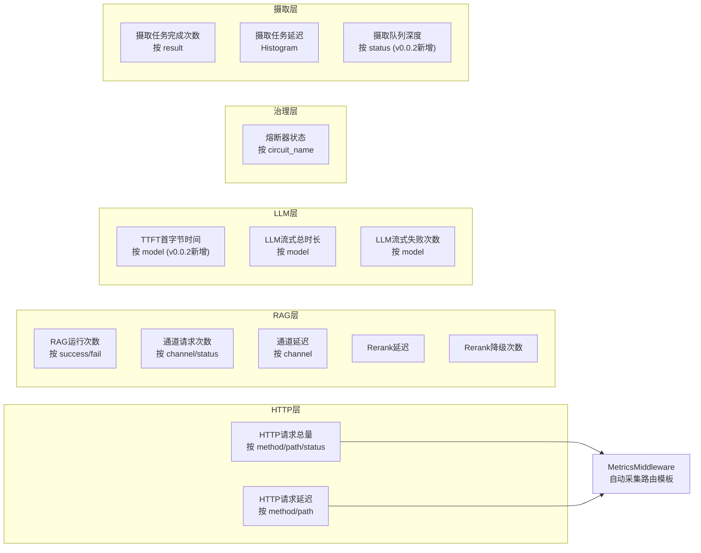

完整指标清单：

| 指标名 | 类型 | 标签 | 说明 |
|--------|------|------|------|
| `flavorag_http_requests_total` | Counter | method, path, status | HTTP 请求总量 |
| `flavorag_http_request_duration_seconds` | Histogram | method, path | HTTP 请求延迟 |
| `flavorag_rag_runs_total` | Counter | status | RAG 完成次数 |
| `flavorag_retrieval_channel_total` | Counter | channel, status | 检索通道请求 |
| `flavorag_retrieval_channel_duration_seconds` | Histogram | channel | 通道延迟 |
| `flavorag_rerank_duration_seconds` | Histogram | - | Reranker 延迟 |
| `flavorag_rerank_fallback_total` | Counter | - | Reranker 降级次数 |
| `flavorag_llm_first_token_seconds` | Histogram | model | **TTFT 首字节时间** |
| `flavorag_llm_stream_duration_seconds` | Histogram | model | LLM 流式总时长 |
| `flavorag_llm_stream_failures_total` | Counter | model | LLM 流式失败次数 |
| `flavorag_circuit_breaker_open` | Gauge | name | 熔断器开/关状态 |
| `flavorag_ingestion_jobs_total` | Counter | result | 摄取任务完成统计 |
| `flavorag_ingestion_job_duration_seconds` | Histogram | - | 摄取任务耗时 |
| `flavorag_ingestion_queue_depth` | Gauge | status | 摄取队列各状态深度 |

**TTFT（Time To First Token，v0.0.2 新增）**：`flavorag_llm_first_token_seconds` 指标专门测量从 LLM 请求发出到收到第一个流式 token 的时间。这是用户体验的核心指标——用户不需要等整个回答生成完毕，只需要等第一个字出现就能开始阅读。该指标按 model 分标签，便于对比不同模型的响应速度。

**低基数约束**：所有 label 值都来自有限集合——HTTP path 使用路由模板而非原始 URL（避免 `/chat/session/abc123` 这种高基数路径），model/channel/status 也都来自固定枚举。这保证了 Prometheus 时间序列数量可控。

指标通过 `GET /metrics` 端点暴露，Prometheus 每隔 `scrape_interval`（默认 15s）抓取一次。Grafana 预置大盘可直接导入。

### 6.2 链路上报（OpenTelemetry + Jaeger）

`app/observability/otel.py` 提供 OpenTelemetry 集成，支持：

- 将 span（链路节点）通过 OTLP 协议导出到 Jaeger 等后端
- 支持从上游传入的 traceparent 自动继承 trace_id
- 回溯创建 span（先记录开始时间、结束后补填耗时）

环境变量：
- `OTEL_ENABLED=false` — 按需开启
- `OTEL_EXPORTER_OTLP_ENDPOINT=http://localhost:14318`
- `OTEL_SERVICE_NAME=flavorag-server`

### 6.3 业务追踪

`app/rag/trace.py` 的 `TraceLogger` 将每次问答的完整链路节点（改写、意图、各通道检索、去重、补偿、Rerank、LLM）持久化到 `t_rag_trace_run` 和 `t_rag_trace_node` 表。

管理后台 `TracesPage` 可以：
- 按时间范围查询 Trace 记录
- 查看每次问答的完整链路节点时序
- 对比各环节耗时分布
- 排查异常节点和错误信息

---

## 7. Graph RAG

### 7.1 总体设计：双层图谱架构

Flavor-RAG 的图谱方案分为两层，各自独立、互相补充：

- **Layer 1 — Neo4j 确定性实体图谱**：零 LLM 依赖，入库时通过正则规则从文本中提取实体、自动构建共现关系图。即使所有外部服务不可用，这一层始终能检索。
- **Layer 2 — LightRAG 语义增强图谱**：在 Layer 1 基础上，把完整文档文本发送给 LightRAG HTTP 服务，由其内部 LLM 做 GraphRAG 风格的深度实体/关系抽取。这一层质量更高但依赖于 LLM，属于可选增强。

两层图谱的数据来源都是文档分块，在入库时同步构建；在检索时，两层结果合并后一起送入 RRF 融合流程。

v0.0.6 在双层图谱之上增加了**权限范围层**和**跨库桥**：

- 单库请求只向一个 `RetrievalScope` 检索；
- `kb_id=*` 先解析用户可读 KB，再让两层图谱逐库检索；
- Neo4j 节点带 `tenant_id`、`kb_id`、`normalized_name`；
- 同租户不同 KB 的规范化同名实体经过质量过滤后，使用 `CROSS_KB_RELATED` 连接；
- 每个共享实体在每对知识库之间只保留一条代表桥，代表节点取库内 `FLAVOR_RELATED` 度数最高者；
- 图读取只接受已经过 SQL 权限解析的 `kb_ids`，不能由客户端直接扩张范围。

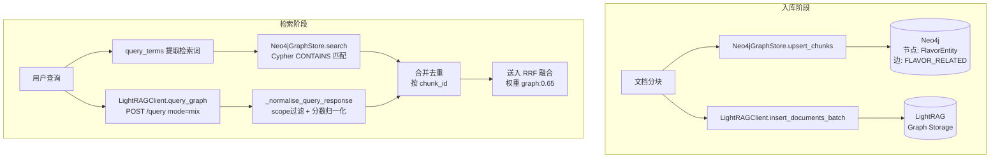

**为什么用双层而不是单纯依赖 LightRAG？**  

LightRAG 的实体提取依赖 LLM，存在三个不可避免的问题：(1) LLM 调用有延迟和成本，(2) LLM 可能不可用，(3) LLM 提取结果不稳定。Neo4j 层用确定性正则做实时实体提取，每次都一样、无额外成本、不依赖外部服务，是图谱检索的"兜底"保障。LightRAG 是锦上添花。

---

### 7.2 入库阶段：图谱如何随文档入库自动构建

图谱构建发生在文档入库流程的最后一步。入口在 `IngestionPipeline._sync_to_lightrag`：

```
成功入库(PG + Milvus) → 如果 graph_enabled:
    1. Neo4jGraphStore.upsert_chunks()   ← 确定性实体图谱 (始终执行)
    2. LightRAGClient.insert_documents_batch()  ← 语义增强 (可选)
```

**时序上先 Neo4j 后 LightRAG**，Neo4j 成功后立即返回结果给入库主流程；LightRAG 失败只记一条 warning 日志，不影响入库整体成功。

#### 7.2.1 实体提取：三段正则从文本里"捞出"实体

整个过程在 `Neo4jGraphStore.extract_entities()` 中完成，无 LLM，纯正则。从每个 chunk 的文本内容中，按三类模式分别提取：

**第 1 轮 — Markdown 标题 → 实体类型 = `section`**

```
正则: ^#{1,6}\s+(.{2,80})$
```

把所有行首以 `#` 开头、长度在 2-80 字符的标题提取出来，并去掉前面的数字序号（如 "1.1 概述" → "概述"）。标题天然是文档结构的骨架，把它们作为实体可以支撑"这个文档有哪些章节"这类结构性问题。

**第 2 轮 — 反引号包裹的代码标识符 → 实体类型 = `identifier`**

```
正则: `([^`\n]{2,80})`
```

对技术文档、API 文档尤其有效。例如文中出现 `` `createUser` ``、`` `GET /api/users` ``，这些反引号包裹的词大概率是函数名、接口路径、配置项名等重要的技术概念。

**第 3 轮 — 驼峰命名 / 路径命名 → 实体类型 = `identifier`**

```
正则: \b(?:[A-Z][A-Za-z0-9]+){1,}[A-Za-z0-9]*\b   ← 驼峰/帕斯卡命名
      \b[A-Za-z][A-Za-z0-9_.-]+/[A-Za-z0-9_./-]+\b  ← 路径命名 (a/b/c)
```

识别 `UserService`、`OrderController`、`com/example/app` 这类代码命名和路径。

**去重与过滤规则：**

三轮提取完成后，所有候选实体经过以下归一化和过滤：

| 步骤 | 规则 |
|------|------|
| 归一化 | 合并多余空格，去掉首尾的 `-, :：, ，。` |
| 长度过滤 | 长度 < 2 或 > 80 → 丢弃 |
| 去重 | 大小写不敏感去重（`casefold`） |
| 黑名单 | 排除 `typescript`、`javascript`、`string`、`true`、`false` 等通用无用词 |
| 上限 | **每个 chunk 最多 12 个实体** |

"每个 chunk 最多 12 个"这个限制是刻意设计的——图谱的价值在于找到关键锚点，而非把文本中每一个可能的词都灌进去。跨 chunk 的实体仍会按文档级确定性 ID 去重。

**实体的 ID 生成：**

```python
def _entity_id(kb_id, doc_id, name):
    digest = sha256(f"{kb_id}:{doc_id}:{name.casefold()}").hexdigest()[:24]
    return f"flavor:{digest}"
```

实体 ID = `flavor:` + SHA256 前 24 位。用 `kb_id:doc_id:name` 做盐值，保证跨知识库的同名实体不会冲突，同时同一文档的同一实体名总是得到相同 ID（天然幂等）。

**实体的描述字段：**

每个实体的 `description` 不是 LLM 生成的，而是从原文中"抠"出来的上下文片段：

```python
def _description_for(name, content):
    compact = " ".join(content.split())        # 合并空白
    index = compact.casefold().find(name.casefold())  # 找到实体名所在位置
    start = max(0, index - 100)                # 往前取 100 字符
    return compact[start:start + 360]          # 共取 360 字符
```

也就是说，实体描述 = 原文中实体首次出现时前后各 100 / 260 个字符的上下文。这样在检索阶段，用户查询的词如果能命中实体的 description，就相当于命中了原文的上下文语境。

#### 7.2.2 关系构建：共现即关系

核心假设：**同一块文本中同时出现的两个实体，大概率存在语义关联。**

v0.0.6 增加第二类确定性关系：**跨库同名实体桥**。实体名先做 Unicode `casefold`，再去除空格、标点和下划线得到 `normalized_name`。只有 `tenant_id` 相同、`kb_id` 不同、`normalized_name` 非空且相同，并通过 `cross_linkable` 质量过滤的节点才会连接。

质量过滤只影响跨库桥，不会删除库内节点或库内共现边：

| 规则 | 处理 |
|---|---|
| 纯数字、空名称 | 不建立跨库边 |
| 非中文实体少于 3 个规范化字符 | 不建立跨库边 |
| 中文实体少于 2 个规范化字符 | 不建立跨库边 |
| `GET`、`IF`、`TABLE`、`ID`、`NULL` 等通用代码/结构词 | 保留节点，但不建立跨库边 |
| `Graph RAG`、`Graph-RAG`、`graph_rag` | 统一为 `graphrag`，允许匹配 |

为避免一个实体在多个文档重复出现时形成完全二部图，系统按 `(tenant_id, normalized_name, kb_id)` 分组。每个知识库选择库内 `FLAVOR_RELATED` 度数最高的节点作为代表，ID 用作稳定的次级排序；每对知识库只创建一条代表桥。

跨库边记录 `match_method=normalized_exact_match`、`confidence=1.0`、`tenant_id` 和 `normalized_name`，保证关系可解释、可审计。使用 `MERGE` 后，重复执行不会产生重复边。语义同义关系如果后续引入，必须使用独立关系类型并保存模型、置信度和来源，不能伪装成确定性的同实体关系。

库内关系构建逻辑（`upsert_chunks`）：

```python
for chunk in chunk_list:
    entity_ids = [...]  # 这个块提取出的实体 ID 列表

    # 取前 8 个实体两两连接
    for index, source in enumerate(entity_ids[:8]):
        for target in entity_ids[index + 1:8]:
            left, right = sorted((source, target))
            # 按 (source, target, chunk_id) 去重
            relation_rows.append({
                "source": left,
                "target": right,
                "chunk_id": chunk_id,
            })
```

关键设计决策：

- **上限 8 个实体参与组网**：一个 chunk 可能提取出很多实体（尤其在 API 文档中），如果全部两两连接会产生 O(n²) 爆炸。限制 8 个是性能和语义的折中——前 8 个是按提取顺序的（标题优先、反引号标识符其次、驼峰命名最后），排序本身就隐含了重要性。
- **边属性**：`label='共现'`、`weight=1.0`、`chunk_id`（标明这条边来自哪个块）、`doc_id`、`kb_id`。
- **幂等更新**：`MERGE` 语句，不会重复创建已存在的节点和边。

#### 7.2.3 历史图迁移

旧图已经保留 `name`、`kb_id`、`doc_id`、`chunk_id` 和 `content` 时，不需要重新创建知识库，也不需要重新 chunk、Embedding、写 Milvus 或写 Elasticsearch。迁移器从 PostgreSQL 读取有效知识库的 `kb_id → tenant_id` 映射，在 Neo4j 原地执行：

1. 扫描有效知识库下的 `FlavorEntity`；
2. 回填 `tenant_id`、`normalized_name`、`cross_linkable`；
3. 按质量规则选择各 KB 的代表节点；
4. 清理目标知识库已有的 `CROSS_KB_RELATED`；
5. 幂等重建代表性跨库边。

```bash
# 只读预演
python -m app.rag.graph.backfill

# 正式应用
python -m app.rag.graph.backfill --apply
```

2026-07-28 当前环境迁移结果：

| 指标 | 结果 |
|---|---:|
| 扫描并补齐的有效实体 | 5,884 |
| 通过过滤的跨库共享实体名 | 244 |
| 创建的代表性跨库边 | 326 |
| 当前全库星图可见跨库边 | 47 |

正式迁移已验证 `Graph`、`RAG`、`PostgreSQL`、`Redis`、`Agent`、`LLM`、`API`、`Skill` 等跨库桥。迁移命令支持重复执行；相同输入会得到相同代表节点和关系集合。

#### 7.2.4 新增知识库和文档的增量构图

新增知识库本身不产生空图关系；首篇文档成功分块后，现有入库流程自动调用 `Neo4jGraphStore.upsert_chunks()`。不需要管理员手工运行迁移：


增量维护覆盖三种生命周期：

- **新增文档**：新实体与同租户其他知识库的既有实体匹配，自动增加代表桥；
- **更新/重新处理文档**：先记录旧实体键，再替换该文档节点，最后重建新旧两组受影响关系，避免残留旧桥；
- **删除文档**：删除前记录实体键，节点删除后从剩余节点中重新选择最高度数代表；如果已无跨库同名实体，则关系自然消失。

增量重建只处理本次文档涉及的实体键，不扫描全部知识库，也不触碰向量索引。一次性迁移仅用于升级前已经存在的旧 Neo4j 数据，后续正常入库无需重复运行。

#### 7.2.5 Cypher 写入：先删后建 + MERGE 幂等

整个 upsert 在同一个 Neo4j session 中按以下顺序幂等执行：

```
1. CREATE INDEX flavor_entity_kb IF NOT EXISTS    ← 保证查询走索引
2. 读取该文档原有的 (tenant_id, normalized_name) 作为 old_keys
3. MATCH (n:FlavorEntity) WHERE kb_id=$kb_id AND doc_id IN $doc_ids DETACH DELETE n
   ← 先删除该文档的所有旧节点（包括关联边）
4. UNWIND $entity_rows AS row
   MERGE (entity:FlavorEntity {id: row.id})
   SET entity.name=..., entity.normalized_name=..., entity.cross_linkable=..., ...
5. UNWIND $relation_rows AS row
   MATCH (source:FlavorEntity {id: row.source})
   MATCH (target:FlavorEntity {id: row.target})
   MERGE (source)-[relation:FLAVOR_RELATED {chunk_id: row.chunk_id}]->(target)
   SET relation.label='共现', relation.weight=1.0, ...
6. 合并 old_keys 与新实体键，仅重建受影响的 CROSS_KB_RELATED
```

"先删后建"保证文档重新入库时旧图谱数据被替换。跨库关系使用更新前后的实体键局部重建，因此代表节点被删除或降级时也不会留下断桥。`MERGE` 保证节点、库内边和跨库边均可幂等维护。

#### 7.2.6 LightRAG 层：构造文档文本 → HTTP 调用

Neo4j 构建完成后，代码接着调用 LightRAG：

```python
# 1. 把所有 chunk 按 doc_id 分组
grouped = {}
for item in chunks:
    grouped.setdefault(item.doc_id, []).append(item.content)

# 2. 每个文档的所有块拼接成完整文本，一次性 POST 给 LightRAG
for doc_id, texts in grouped.items():
    await client.post("/documents/text", json={
        "text": "\n\n".join(texts),
        "file_source": f"{collection_name}_{doc_id}"
    })
```

LightRAG 内部的 LLM 会从完整文本中做实体和关系抽取（GraphRAG 标准流程：实体识别 → 关系抽取 → 社区摘要 → Leiden 聚类），存储到自己的图存储中。

---

### 7.3 检索阶段：图谱如何为问答召回证据

检索时，图谱通道和其他两路（向量、关键词）并发执行。入口在 `RAGPipeline.run()` 中的 `graph_search()` 闭包。

v0.0.6 的全库请求不会构造一个不受控的“大 collection”，而是对解析后的范围做 fan-out：

```text
subqueries × readable RetrievalScope[]
  ├─ Milvus(collection_name, embedding_model)
  ├─ Elasticsearch(filter kb_id)
  ├─ Neo4j(search kb_id)
  └─ LightRAG(query + file_source scope tokens)
                    ↓
            channel 内拉平、统一 RRF
                    ↓
 PostgreSQL filter_authorized_results(kb_ids=[...])
```

这允许不同知识库使用不同 active collection 或 embedding model，同时保证最终证据只能来自请求开始时解析出的精确可读 KB 集合。

#### 7.3.1 Neo4j 检索：分词 → Cypher 匹配 → 返回 chunk

**Step 1 — 查询词提取**（`query_terms`）：

```python
def query_terms(query):
    terms = re.findall(r"[A-Za-z][A-Za-z0-9_.:/-]{1,}|[\u4e00-\u9fff]{2,}", query)
    return list(dict.fromkeys(term.casefold().strip() for term in terms))[:12]
```

把用户查询拆成两类 token：英文标识符（至少一个字母开头）和中文词组（至少两个汉字），做大小写归一化后去重，最多取 12 个。例如 "请说明 Redis 的缓存策略" → `["redis", "缓存策略"]`。

**Step 2 — Cypher 匹配**（`search`）：

```cypher
MATCH (entity:FlavorEntity {kb_id: $kb_id})
WHERE any(
    term IN $terms
    WHERE toLower(entity.name) CONTAINS term
       OR toLower(entity.description) CONTAINS term
)
WITH entity,
     CASE
       WHEN any(term IN $terms WHERE toLower(entity.name) CONTAINS term)
       THEN 1.0 ELSE 0.72
     END AS score
RETURN entity.chunk_id, entity.doc_id, entity.content, entity.name, score
ORDER BY score DESC, size(entity.name) ASC
LIMIT $limit
```

这段 Cypher 的逻辑：

1. **按 kb_id 隔离**：保证多租户场景下不会跨知识库检索。
2. **双重匹配**：查询词既匹配实体名称（`name CONTAINS`），也匹配实体描述（`description CONTAINS`）。
3. **分级得分**：名称精确包含查询词 → 1.0 分；仅描述包含 → 0.72 分。这个设计理念是"实体名命中比上下文命中更精确"。
4. **排序策略**：先按得分降序，再按实体名称长度升序。短的实体名（如 "Redis"）通常比长的（如 "Redis 缓存策略最佳实践指南"）更精确，因为长名可能只是凑巧包含了查询词。
5. **去重返回 chunk**：同一个 chunk 可能被多个实体命中，用 `seen_chunks` 去重，保证每个 chunk 只在结果中出现一次。结果中 `metadata.graphEntity` 字段保留了匹配到的实体名，前端可以用来展"为什么推荐这个结果"。

#### 7.3.2 LightRAG 检索：HTTP 查询 + 范围过滤 + 结果标准化

```python
async def query_graph(query, mode="mix", top_k=5, ...):
    response = await client.post("/query", json={
        "query": query,
        "mode": "mix",         # local + global + naive 三种模式混合
        "top_k": top_k,
        "only_need_context": True,
        "include_references": True,       # 要来源引用
        "include_chunk_content": True,    # 要原文内容
    })
```

- **mode="mix"**：LightRAG 的混合查询模式，同时从局部图（local，围绕具体实体）、全局图（global，利用社区摘要）、朴素模式（naive，直接文本匹配）三个维度检索，取并集。
- **`include_references=True`**：要求返回每个结果的引用来源（file_path、chunk_id 等元数据）。
- **`include_chunk_content=True`**：要求直接返回原文内容，避免二次反查。

LightRAG 返回的 JSON 中有 `references` 数组，`_normalise_query_response` 做了以下标准化处理：

```
references → 
  过滤 scope (file_path 包含 collection_name 或 kb_id) → 
  展开 content (支持 list 和 str) → 
  修复 UTF-8 乱码 (_repair_text) → 
  分数归一化: score = 1.0 / (rank + 1) → 
  设置 channel = "graph"
```

**范围过滤**是关键一步：LightRAG 本身不区分知识库，所有文档的实体混在一个图中。`_matches_scope` 通过检查 `file_path` 是否包含 `kb_id` 或 `collection_name` 来做逻辑隔离，防止跨知识库的图谱数据互相串扰。

#### 7.3.3 超时与降级策略

图谱通道的调用在 RAGPipeline 中使用了多层保护：

```
graph 通道
  ├─ CircuitBreaker 熔断 (3次失败→打开, 30s后半开)
  ├─ asyncio.wait_for 超时 (channel_timeout_ms / 1000)
  └─ LightRAG 单独更短超时 (max(0.5, min(1.5, channel_timeout_ms/2000)) 秒)
```

LightRAG 的额外短超时是一种**快速失败**策略：如果 LightRAG 在 0.5~1.5 秒内没有响应，立即放弃它，只使用 Neo4j 的搜索结果。日志会记录 `lightrag_query_timeout_using_native_graph`，不会影响整体检索返回。

#### 7.3.4 单次请求级别的开关控制

用户可以在 API 请求中显式控制 `graph_rag` 参数：

- `graph_rag=true`：强制开启图谱检索（即使全局配置是关闭的）
- `graph_rag=false`：强制关闭图谱检索（即使全局配置是开启的）
- 不传：使用全局配置 `settings.graph_enabled`

这允许高级用户在特殊场景下按需打开图谱，比如处理多跳推理问题时临时启用。

**全库模式例外**：当 `kb_id=*` 时，Graph RAG 是跨库检索协议的一部分，前端会开启并锁定开关，服务端也会把 `graph_rag=false` 覆盖为 true。该约束不能依赖客户端自觉遵守。

---

### 7.4 图谱可视化

除了检索，图谱还直接提供可视化数据给前端：

**实体标签搜索**：
```
GET /graph/label/search?q=Redis&limit=30   ← 搜索包含 "Redis" 的实体
GET /graph/label/popular?limit=30           ← 获取热门实体
```

**组合图获取**（`fetch_graph`）：
```cypher
MATCH (node:FlavorEntity)
WHERE node.kb_id IN $kb_ids
  AND ($entity='*' OR toLower(node.name) CONTAINS toLower($entity))
OPTIONAL MATCH (node)-[r:FLAVOR_RELATED|CROSS_KB_RELATED]-(neighbor)
WHERE neighbor.kb_id IN $kb_ids
WITH node, count(r) AS degree
WITH coalesce(toLower(trim(node.entity_type)), 'unclassified') AS entity_type,
     node, degree
ORDER BY entity_type, degree DESC, node.name
WITH entity_type, collect(node)[..201] AS typed_nodes
```

公共接口把 `limit` 限制在 1..200。单库模式沿用总量上限；`kb_id=*` 全库模式按规范化实体类型分别读取 `limit + 1`，因此某类的第 201 个节点只截断该类型，不挤占其他类型。响应通过 `limitMode`、`limitPerType`、`typeStats`、`truncatedByType` 说明限制结果；节点附带 `knowledgeBaseId/knowledgeBaseName`，边附带 `type/crossKnowledgeBase`。

LightRAG 同样有 `/graphs` 接口（`fetch_graph`），返回格式与 Neo4j 一致，前端可以切换数据源。

前端 `KnowledgeGraphPanel` 使用确定性知识库聚类布局，而不是每次随机抖动的力导向图。低缩放级别按“知识库 × 实体类型”显示聚合星团；进入详情缩放后，只渲染视口及 overscan 范围内的节点和两端均可见的边，选中/召回节点保持固定，避免大图拖慢交互。交互状态为 `{x, y, scale}`：拖动 SVG 画布改变平移量；滚轮缩放以鼠标位置为锚点并限制在 45%..250%；按钮提供缩放和复位。局部关系使用实线，跨库桥使用紫色虚线。Graph 通道实际返回证据后，前端从查询命中的实体开始选择一条确定性连通路径，播放边光流和节点呼吸；系统设置 reduced motion 时只保留静态高亮。

---

### 7.5 图谱通道在 RRF 融合中的位置

图谱返回的 `SearchResult` 和其他两个通道一样喂入 `rrf_fusion()`。图谱的默认权重是 `0.65`，低于向量和关键词的 `1.0`。这是故意为之——图谱检索的精度不如向量和关键词（尤其是 Neo4j 层只有简单的 CONTAINS 匹配），降低权重可以防止图谱的低质量结果把高质量结果"挤"下去。

每个图谱结果带 `metadata.graphEntity`，标明命中了哪个实体。在 RRF 融合的通道归因记录中，图谱的贡献可单独追踪。

**当前实验状态**：根据投资决策框架评估，GraphRAG 目前默认关闭（`graph_enabled=false`），原因是缺少足够的标注多跳评测样本来量化增量收益。待积累 ≥5 个多跳用例并测量 Recall@K 提升后，再决定是否默认开启。

---

## 8. Agentic RAG

### 8.1 设计理念

Agentic RAG 给检索增加了 **"多步推理"** 的能力。传统 RAG 是"一次检索+一次回答"，Agentic RAG 则是"检索→评估证据→（可选）再检索→（可选）调用工具→最终回答"。

核心约束：**受控循环**，不允许 Agent 自由执行任意操作。每次行动必须是预注册工具列表中的合法操作，步数有硬上限。

### 8.2 架构

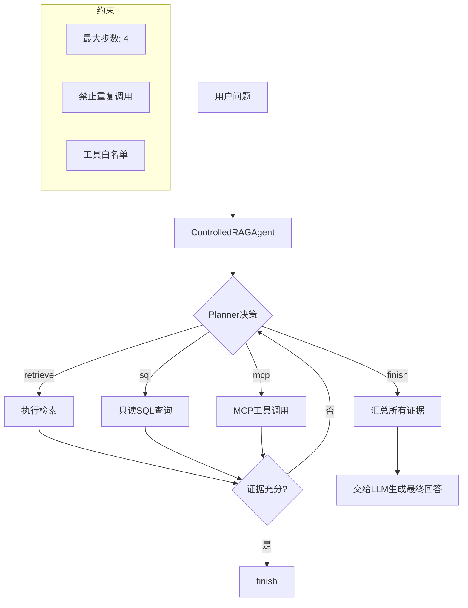

### 8.3 ControlledAgent 核心机制

**Planner**（`plan_next_action`）：
- 调用 LLM（温度=0，保证确定性），要求返回下一步行动
- 只允许白名单中的工具，不允许编造
- 返回格式：`{"tool":"retrieve|sql|finish", "arguments":{...}}`
- 解析失败 → 自动 `finish`

**Agent 循环**（`ControlledAgent.run`）：
1. 初始状态：问题 + 空步骤列表
2. Planner 决策下一步
3. 如果 `tool == "finish"`：退出循环，返回结果
4. 如果调用签名与历史重复：退出循环，防止死循环
5. 执行工具，记录观察结果
6. 达到 `max_steps`（默认 4）：退出循环

### 8.4 可用工具

| 工具 | 说明 | 注册条件 |
|------|------|---------|
| `retrieve` | 调用完整 RAG 检索链路 | 始终可用 |
| `sql` | 只读 SQL 查询（白名单表） | `sql_tool_enabled=true` |
| `mcp:*` | MCP 协议工具（可配置多个） | `mcp_tool_enabled=true` |

**SQL 工具安全限制**：
- 只允许 `SELECT` 语句
- 只允许 `sql_tool_allowed_relations` 配置的白名单表
- 使用 `sqlalchemy.text` + 绑定参数，防注入
- 结果集限制 100 行

**MCP 工具**：
- 通过 JSON 配置多个 MCP 端点
- 每个工具独立配置只读属性、超时时间
- `mcp_allowed_tools` 控制哪个工具可用

### 8.5 Agentic RAG 与普通 RAG 的区别

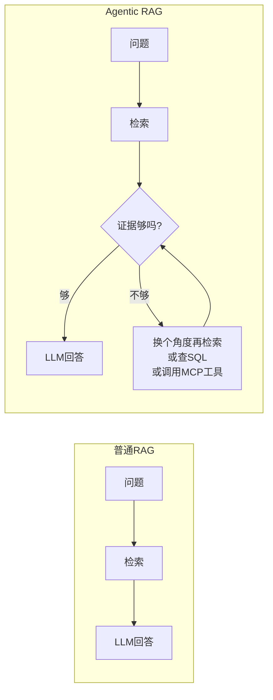

Agentic RAG 的结果中：
- `context_chunks` 包含所有检索到的文本块
- `sources` 中新增 `blockType: "TOOL_RESULT"` 的工具调用结果
- `agent_steps` 记录每一步的工具名、参数、观察结果

### 8.6 启用方式

通过配置 `agentic_rag_enabled=true` 全局启用，或由 API 调用方按请求指定。当前默认关闭。

---

## 9. 批量导入与文档去重

> **v0.0.2 新增**。批量导入解决了"逐个上传 50 个文档需要点 50 次"的痛点；文档去重防止同一份文档被反复上传浪费存储和向量索引空间。

### 9.1 批量导入架构

批量导入由 `BatchImportHandler` 统一编排，核心设计原则是**逐文件隔离**——每个文件在独立的数据库 Session 中完成完整入库流程（解析→分块→嵌入→索引），一个文件失败不影响其他文件。

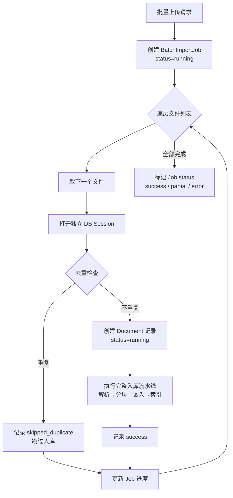

**关键设计要点：**

- **独立 Session**：每个文件打开一个独立的 `async_session_factory()`。如果 50 个文件用同一个 Session，第 3 个文件失败会导致前 2 个文件的改动一起回滚。独立 Session 保证每个文件的事务隔离。
- **进度精确追踪**：数据库中有 `BatchImportJob`（总任务）和 `BatchImportFileRecord`（每个文件）两张表，前端可以实时展示"50 个文件中已完成 32 个，失败 1 个，跳过重复 3 个"。
- **错误容错**：单个文件处理失败会记录错误信息到 `BatchImportFileRecord.error_message`，但不影响后续文件。最终状态：全部成功 → `success`，部分失败 → `partial`，全部失败 → `error`。

### 9.2 文档去重：两级检测策略

去重由 `DuplicateDetector` 实现，分两级：

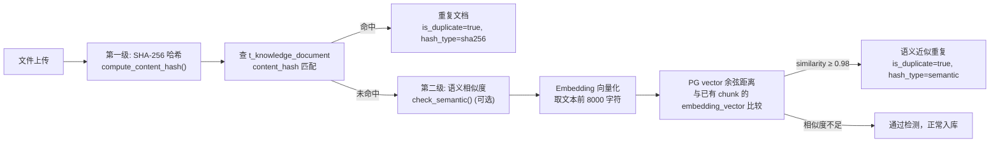

#### 第一级：SHA-256 内容哈希

最直接的去重方式——计算文件的 SHA-256 哈希值，在 `t_knowledge_document` 表中按 `kb_id + content_hash` 查找是否已存在。哈希相同 = 文件内容 100% 相同，直接拒绝。

**为什么用 SHA-256 而不是 MD5？** 虽然 MD5 更快，但存在碰撞风险（不同文件产生相同哈希）。对于去重场景，SHA-256 的碰撞概率（2^-128）在实际应用中可视为零。

#### 第二级：语义相似度（可选深检）

SHA-256 只能检测完全相同的文件。如果用户上传了同一份文档的"稍作修改版"（比如改了标题、调整了格式），SHA-256 会认为是不同文件。语义检测通过比较嵌入向量的余弦距离来发现这类"近重复"：

```python
async def check_semantic(self, text, kb_id, db, *, tenant_id):
    # 1. 取文本前 8000 字符做 Embedding
    query_vector = await embedder.embed_query(text[:8000])

    # 2. 用 PG vector 的 <=> 操作符计算余弦距离
    #    (1 - 余弦距离 = 余弦相似度)
    result = await db.execute(text("""
        SELECT kd.id, kd.doc_name,
               1 - (kc.embedding_vector <=> :qv) AS similarity
        FROM t_knowledge_chunk kc
        JOIN t_knowledge_document kd ON kd.id = kc.doc_id
        WHERE kd.kb_id = :kb_id AND kd.deleted = 0
        ORDER BY similarity DESC LIMIT 1
    """), {"qv": json.dumps(query_vector), "kb_id": kb_id, ...})

    # 3. 相似度 ≥ 阈值(0.98) → 判定为重复
```

阈值 0.98 是相对保守的设置——宁可漏掉极少数近重复文档，也不要把不同文档误判为重复。如果语义检测失败（比如 PG 不支持 pgvector 扩展），系统不会阻断入库流程，只记录一条 warning。

#### 批量导入内部的去重

批量导入在处理多个文件时，还会先做一次**批量内去重**（`find_duplicates_in_batch`）——对本次上传的文件列表做 SHA-256 去重，同一批中内容相同的文件只处理一次。这防止用户批量选择时无意中选了同一个文件两次。

### 9.3 配置与使用

在知识库管理页面上传文件时，选择多个文件即可触发批量导入。系统会自动：
1. 对上传的文件做批量内去重
2. 每个文件与数据库中已有文档做 SHA-256 去重
3. 非重复文件依次执行完整入库流水线
4. 返回详细的进度报告

---

## 10. 异步摄取与增量索引

> **v0.0.2 新增**。将文档入库从"同步阻塞"升级为"异步队列"，支持大文件后台处理；新增增量索引机制，文档内容未变化时跳过重建，大幅节省资源。

### 10.1 异步摄取：Outbox 模式 + Worker 池

传统方式下，用户在 API 中上传文档 → 等待解析/分块/嵌入/索引完成 → 返回结果。对于几 MB 的文档可能需要数十秒，HTTP 连接在此期间一直保持，容易超时。

v0.0.2 引入 **Outbox 模式**：API 层只负责创建 `IngestionJob` 记录（写入数据库即返回），后台 Worker 异步执行实际的入库工作。

```mermaid
flowchart TB
    subgraph API层
        A[用户请求入库] --> B[创建 IngestionJob<br/>status=QUEUED<br/>写入数据库]
        B --> C[doc.status=queued]
        C --> D[返回 job_id<br/>API 响应 < 100ms]
    end

    subgraph Worker层
        E[IngestionJobWorker<br/>每 5s 轮询一次] --> F{FOR UPDATE SKIP LOCKED<br/>获取待处理任务}
        F --> G[逐个执行 execute_ingestion]
        G -->|成功| H["job.status=SUCCESS<br/>记录 chunk_count + duration_ms"]
        G -->|失败| I{"已达最大重试<br/>次数?"}
        I -->|否| J["job.status=RETRY<br/>指数退避: 2^n 分钟后重试"]
        I -->|是| K["job.status=DEAD<br/>死信队列, 需人工介入"]
    end

    subgraph Watchdog层
        L[IngestionWatchdog<br/>每 60s 检查] --> M{RUNNING 任务<br/>心跳超 15 分钟?}
        M -->|是| N["job.status=timeout<br/>标记为僵尸任务"]
    end
```

**Job 状态机：**

```
QUEUED → RUNNING → SUCCESS
                 → RETRY → QUEUED (重试) 或 DEAD (耗尽)
                 → (被 Watchdog 超时回收) → RUNNING
```

**Worker 核心机制：**

1. **FOR UPDATE SKIP LOCKED**：Worker 使用 PostgreSQL 的行级锁 + 跳过已锁行来安全地并发获取任务。多个 Worker 实例不会抢同一个任务。

2. **指数退避重试**：失败任务的重试间隔按 `2^attempts` 分钟递增（上限 30 分钟），避免对下游服务（Milvus、ES）造成雪崩式重试压力。

3. **可重试 vs 永久失败**：Worker 区分两种错误：
   - 可重试（网络超时、Milvus 暂时不可用等）→ RETRY + 退避
   - 永久失败（KB 不存在、源文件丢失等 `_PermanentJobError`）→ 直接 DEAD

4. **看门狗（Watchdog）**：`IngestionWatchdog` 每 60 秒扫描一次，将超过 15 分钟无心跳的 RUNNING 任务标记为 `timeout`，防止 Worker 崩溃后任务永久卡在 RUNNING 状态。

**前端管理：** 管理后台的 `MonitoringPage` 可以实时查看各状态任务数量、最近任务列表，并支持手动将 DEAD 或 RETRY 任务重新入队。

### 10.2 增量索引：跳过未变化文档

定时刷新文档时（例如 URL 类型文档需要定期抓取最新内容），如果每次都全量重建所有文档的索引，会浪费大量计算资源。增量索引通过内容哈希比较来跳过未变化的文档：

```mermaid
flowchart TD
    A[定时刷新触发] --> B[遍历 KB 中所有文档]
    B --> C[取下一个文档]
    C --> D[下载/读取文件内容]
    D --> E[计算 SHA-256 哈希]
    E --> F{哈希与存储值比较}
    F -->|相同| G[跳过: content_unchanged<br/>不消耗任何检索资源]
    F -->|不同| H[需要重建索引]
    F -->|无旧哈希| H
    H --> I["soft_delete_old_chunks()<br/>软删除旧块"]
    I --> J[执行完整入库流水线]
    J --> K[更新 content_hash]
    G --> C
    K --> C
```

核心实现在 `IncrementalIndexer` 中：

```python
class IncrementalIndexer:
    @staticmethod
    async def check_document_changed(file_path, doc_id, db):
        new_hash = compute_content_hash(file_path)
        old_hash = await get_stored_hash(doc_id, db)

        if not old_hash:
            return ChangeDetectionResult(changed=True, reason="no_existing_hash")
        if new_hash == old_hash:
            return ChangeDetectionResult(changed=False, reason="content_unchanged")
        return ChangeDetectionResult(changed=True, reason="content_changed")
```

**与批量导入/异步摄取的协同**：增量索引的判断逻辑和异步摄取是独立的——增量检查在定时刷新流程中执行，跳过不变化文档可以避免向摄取队列中写入无意义的 Job。但当检测到变化时，同样走异步摄取通道处理。

---

## 11. 系统监控与健康检查

> **v0.0.2 新增**。内置监控面板和健康检查页面，无需部署 Grafana 即可了解平台运行状态。Prometheus 指标可对接外部 Grafana 做长期趋势分析。

### 11.1 监控面板

`MonitoringPage` 提供以下功能模块：

**RAG 检索问答指标：**

| 指标 | 数据来源 | 刷新频率 |
|------|---------|---------|
| 请求总数 | `t_rag_trace_run` 窗口内聚合 | 30s 自动刷新 |
| 成功率 | success / total | 30s |
| 平均耗时 / P95 耗时 | `total_duration_ms` 统计 | 30s |
| 检索耗时 / LLM 耗时 | `search_duration_ms` / `llm_duration_ms` | 30s |

**时序图表：**
- **RAG 请求量柱状图**（绿=成功，红=失败）：按时间桶展示请求趋势
- **摄取任务完成量柱状图**（蓝=成功，红=DEAD）：展示吞吐和失败趋势

**异步摄取队列：**

| 指标 | 说明 |
|------|------|
| QUEUED | 排队中任务数 |
| RUNNING | 执行中任务数 |
| RETRY | 等待重试任务数 |
| DEAD | 死信任务数 |
| 窗口内完成 | 选定时间范围内成功数 + 平均耗时 |

**文档状态分布：** 排队中 / 处理中 / 已完成 / 失败

**最近摄取任务列表：** 可按状态筛选，查看每个任务的文档名、操作类型、重试次数、耗时、错误信息。支持手动将 DEAD/RETRY 任务重新入队。

**时间窗口切换：** 支持"近 1 小时"、"近 24 小时"、"近 7 天"三个粒度。

### 11.2 健康检查

`HealthPage` 调用 `GET /api/admin/health` 端点，显示各组件的连接状态：

- `pg`：PostgreSQL 连接状态
- `milvus`：Milvus 连接状态
- `redis`：Redis 连接状态
- `es`：Elasticsearch 连接状态（如启用）

每个组件返回 `ok` / `error` / `disabled` 三种状态，管理员可快速定位哪部分基础设施出了问题。

### 11.3 与 Prometheus/Grafana 的关系

内置监控面板（查 PG 聚合数据）和 Prometheus 指标是**互补关系**：

| 维度 | 内置监控面板 | Prometheus + Grafana |
|------|------------|---------------------|
| 部署依赖 | 零依赖 | 需部署 Prometheus + Grafana |
| 数据来源 | PG 业务表 SQL 聚合 | `flavorag_*` 指标 |
| 时间精度 | 分钟级 | 秒级（受 scrape_interval 影响） |
| 历史保留 | 受 PG 数据保留策略限制 | Prometheus TSDB 独立管理 |
| 图表能力 | 内置柱状图 | Grafana 全功能仪表盘 |
| 告警 | 无 | AlertManager 集成 |

推荐策略：**日常运维用内置面板快速诊断，长期趋势分析和告警用 Prometheus + Grafana。**

---

## 12. Mem0 长期记忆与用户画像

> **v0.0.4 新增**。引入 mem0 长期记忆层，让系统在多次对话中"记住"用户的关键事实。基于用户画像和行为统计，在生成回答时自动注入个性化上下文。

### 12.1 设计理念

传统 RAG 系统的"记忆"仅限于单次会话的上下文窗口——对话一结束，系统就"忘记"了用户说过什么。Mem0 长期记忆层解决的是**跨会话的知识持久化**问题：从对话中自动提取有价值的事实（如偏好、习惯、专业领域），在后续对话中根据需要检索并注入生成 Prompt，让系统表现出"记得你"的连贯体验。

核心设计原则：

- **零侵入**：与现有 RAG 检索链路完全解耦，通过独立的 Milvus collection (`user_memories`) 存储，不影响文档检索
- **智能去重**：新提取的事实会与已有记忆做 LLM 级别的语义比较，判断 ADD（新增）/ UPDATE（更新） / NOOP（跳过），防止记忆膨胀
- **降级友好**：mem0 不可用时不影响主链路——检索失败返回空列表，提取失败静默跳过
- **隐私隔离**：每条记忆按 `user_id + tenant_id` 隔离，不同租户/用户之间的记忆完全隔离

### 12.2 架构总览

```mermaid
flowchart TD
    subgraph 对话阶段 [每次对话]
        A[用户提问] --> B[mem0 记忆检索]
        B --> B1[向量检索<br/>Milvus COSINE]
        B --> B2[关键词检索<br/>ES BM25]
        B1 & B2 --> C[加权融合<br/>vector:kw = 0.7:0.3]
        C --> D[注入 System Prompt]
        A --> E[用户画像拉取]
        E --> D
        D --> F[RAG 检索 + LLM 生成]
        F --> G[返回回答]
    end

    subgraph 后台阶段 [异步后处理]
        G --> H[事实提取<br/>DeepSeek-V4-Flash]
        H --> I[去重判断<br/>ADD / UPDATE / NOOP]
        I --> J[写入 Milvus<br/>user_memories]
        I --> K[写入 ES<br/>mem0_user_memories]
        J --> L[更新画像<br/>mem0_facts_count]
    end

    subgraph 定时阶段 [每日定时]
        M[ProfileDailyScheduler] --> N[全量重建所有用户画像]
        N --> O[更新 PG t_user_profile]
    end
```

### 12.3 记忆生命周期

mem0 中每条记忆有完整的生命周期：

```
对话消息 → 事实提取(LLM) → 去重判断(LLM) → 写入 Milvus + ES → 检索召回 → 注入 Prompt
                                                      ↓ UPDATE
                                                 删除旧记忆
```

#### 12.3.1 事实提取（Fact Extraction）

每次对话结束后，系统将用户消息和助手回复发送给 DeepSeek-V4-Flash（默认 `mem0_model`），由 LLM 判断哪些信息值得长期记住。

**System Prompt 核心约束**：

- 只提取关于**用户**的事实（偏好、习惯、背景、专业领域、常见需求等）
- 忽略一次性临时问题（如"今天天气怎样"）
- 每条记忆用简洁陈述句，不超过 100 字
- 没有值得记住的事实则返回空数组
- 输出 JSON：`{"memories": ["事实1", "事实2", ...]}`

**提取时机**：回答生成完毕、SSE 流结束后的异步 fire-and-forget 调用，不阻塞用户看到答案。

**容错**：
- MockLLMClient（无 API Key）：跳过提取，返回空
- 超时（默认 20s）：放弃提取，记录 warning
- JSON 解析失败：放弃提取，记录 warning

#### 12.3.2 智能去重（Dedup & Conflict Resolution）

在写入新记忆之前，系统先拉取用户已有记忆（最多 200 条），由 LLM 逐条比较新旧记忆的关系，输出三种操作：

| 操作 | 含义 | 触发条件 |
|------|------|---------|
| `ADD` | 新增 | 新信息，与已有记忆不冲突不重复 |
| `UPDATE` | 更新 | 新信息推翻了某条已有记忆（如用户以前用 Java，现在改用 Go） |
| `NOOP` | 跳过 | 与已有记忆重复，无需存储 |

**UPDATE 的实现**：先删除 `old_memory_id` 对应的旧记忆（Milvus 物理删除 + ES 同步删除），再插入新记忆。

**LLM 降级兜底**：如果去重 LLM 调用失败（超时/解析错误），回落为基于文本相似度的简单去重——用 Jaccard 2-gram 计算相似度，阈值 0.92 以上视为重复。

#### 12.3.3 混合检索（Hybrid Retrieval）

记忆检索采用与文档检索平行的双通道架构：

- **向量通道（Milvus）**：COSINE 相似度，IVF_FLAT 索引，`nprobe=16`，按 `user_id` 过滤
- **关键词通道（ES）**：BM25 全文检索，在 `mem0_{collection_name}` 索引中按 `user_id` 精确过滤，`content` 字段 match 查询（boost=2.0）
- **加权融合**：默认向量权重 0.7、关键词权重 0.3，融合后取 top_k 条（默认 5）

```python
# 检索调用示例
memories = await Mem0Manager.get_instance().search(
    user_id=user.id,
    query=question,        # 用当前问题作为检索 query
    top_k=5,
)
```

#### 12.3.4 注入生成 Prompt

检索到的记忆会被格式化为 Markdown 块，追加到 System Prompt 末尾：

```
## 用户记忆
以下是你已经了解的关于用户的信息，请在回答中适当参考：
- 用户公司Java项目使用Spring Boot 3.2框架
- 用户公司数据库使用PostgreSQL
- 用户偏好使用Docker Compose进行本地开发
```

LLM 可以在生成回答时参考这些记忆，例如用户问"怎么部署？"时，LLM 可以根据记忆知道用户用 Docker Compose 而给出针对性建议。

### 12.4 用户画像

用户画像是 mem0 记忆层的"上层建筑"，它不存储原始记忆事实，而是**从行为数据 + mem0 计数 + LLM 领域分析**中聚合出结构化的用户模型。

#### 12.4.1 七个维度

| 维度 | 名称 | 数据来源 | 计算方式 |
|------|------|---------|---------|
| D1 | `profile_version` | PG 自增 | 每次重建 +1 |
| D2 | 专业领域画像 | LLM 分析近期提问 | DeepSeek-V4-Flash 提取 domains + expertise_level + domain_summary |
| D3 | 意图偏好分布 | `t_rag_trace_run` 聚合 | 各 intent 的占比 |
| D4 | 知识库偏好 | `t_rag_trace_run.kb_id` + `t_knowledge_base` | 最常用的 5 个 KB + 文档类型偏好（TABLE/CODE/PARA等） |
| D5 | 查询风格 | `t_conversation_message` 统计 | 平均查询长度、深度思考率、图谱使用率、HyDE 使用率 |
| D6 | 反馈信号 | `t_message_feedback` 统计 | 赞/踩数量、追问率（多轮对话占比） |
| D7 | mem0 事实计数 | `Mem0Manager.count()` | 当前记忆条目总数 |

#### 12.4.2 更新策略

支持两种模式（通过 `profile_update_mode` 配置）：

- **`incremental`（默认）**：每次对话结束后，在 mem0 事实提取完成后异步增量更新（不触发 LLM 领域分析）
- **`daily`**：`ProfileDailyScheduler` 按 Cron 表达式（默认每日凌晨 2:00）全量重建所有活跃用户画像。解析 Cron `"H M * * *"` 格式，每小时轮询一次检查是否到达目标时间

```python
# 增量更新（对话后自动触发）
await build_or_update_profile(profile_session, user.id, user.tenant_id)

# 全量重建（定时器触发）
await ProfileDailyScheduler()._rebuild_all()
```

画像构建有最小数据门槛：用户提问数 ≥ `profile_min_queries_for_build`（默认 5）条才会触发 LLM 领域分析，不足时领域字段留空。

#### 12.4.3 画像在 RAG 中的使用

对话开始前，系统拉取用户画像并注入 System Prompt：

```
## 用户画像
- 专业领域：DevOps, 后端架构
- 专业水平：mid
- 概述：该用户是一名中级后端工程师，主要关注微服务部署和数据库优化...
```

画像数据通过 `RAGContext.profile` → `rag_result.profile` 传递，最终在 API 层拼接到 System Prompt。

### 12.5 配置速查

```bash
# === mem0 长期记忆 (v0.0.4 新增) ===
MEM0_ENABLED=true                              # 全局启用开关
MEM0_COLLECTION_NAME=user_memories             # Milvus collection 名称
MEM0_MODEL=deepseek-v4-flash                   # 事实提取 + 去重 LLM
MEM0_BASE_URL=https://api.deepseek.com/v1      # LLM base URL
MEM0_API_KEY=                                  # 为空时复用 HYDE_API_KEY
MEM0_MAX_TOKENS=1024                           # 提取 prompt 最大 token
MEM0_TIMEOUT_SEC=20.0                          # 提取超时（秒）
MEM0_SEARCH_TOP_K=5                            # 检索时拉取的记忆条数

# === 用户画像 ===
PROFILE_UPDATE_MODE=incremental                # incremental | daily
PROFILE_DAILY_CRON="2 0 * * *"                 # 每日凌晨 2:00 全量重建
PROFILE_LLM_MODEL=deepseek-v4-flash            # 画像聚合 LLM
PROFILE_LLM_BASE_URL=https://api.deepseek.com/v1
PROFILE_LLM_API_KEY=                           # 为空时复用 MEM0_API_KEY
PROFILE_MIN_QUERIES_FOR_BUILD=5                # 最少提问数才构建画像
```

### 12.6 管理后台

前端 `UserProfilePage`（路由 `/admin/profiles`）提供：

- **用户列表**：展示所有活跃用户的画像摘要（领域标签、赞/踩比、记忆条目数、最后活跃时间）
- **画像详情抽屉**：七维画像完整展示（领域标签 → 意图分布 → KB 偏好 → 查询风格 → 反馈信号 → 记忆事实可展开列表）
- **记忆管理**：按用户查看所有记忆事实、支持逐条删除
- **画像重建**：手动触发单用户画像重建
- **配置端点**：`GET /api/admin/profiles/config` 返回 mem0 和画像的运行时配置

后端 API（`app/api/user_profile.py`）：

| 端点 | 方法 | 功能 |
|------|------|------|
| `/api/admin/profiles` | GET | 列出所有用户画像 |
| `/api/admin/profiles/{user_id}` | GET | 获取单用户画像详情 |
| `/api/admin/profiles/{user_id}` | POST | 手动重建画像 |
| `/api/admin/profiles/{user_id}/memories` | GET | 列出用户的所有记忆事实 |
| `/api/admin/profiles/{user_id}/memories/{memory_id}` | DELETE | 删除单条记忆 |
| `/api/admin/profiles/config` | GET | 获取运行时配置 |

### 12.7 数据流总结

```
聊天对话（用户消息 + 助手回答）
    │
    ├── 对话前 ──→ mem0 search(问题) → 注入 System Prompt
    │            └─→ get_profile_for_rag() → 注入 System Prompt
    │
    ├── RAG 检索 + LLM 生成（使用注入的画像/记忆上下文）
    │
    └── 对话后 ──→ extract_facts(对话) → resolve_conflicts(新旧比较)
                  └─→ ADD/UPDATE → insert Milvus + ES
                  └─→ build_or_update_profile(incremental)
                  └─→ (可选) ProfileDailyScheduler → 全量重建
```

---

## 13. 附录：配置速查

### 13.1 关键环境变量

```bash
# === 嵌入模型 ===
EMBEDDING_MODEL=Qwen/Qwen3-Embedding-8B    # 嵌入模型 (4096维)
EMBEDDING_BASE_URL=https://api.siliconflow.cn/v1

# === LLM ===
LLM_MODEL=qwen-plus-latest                  # 默认LLM
CODE_MODEL=deepseek-v3                      # 代码类问题专用
DOC_MODEL=qwen-plus-latest                  # 文档类问题专用
REASONING_MODEL=                            # 深度思考模型 (可选)

# === Reranker ===
RERANKER_MODEL=Qwen/Qwen3-Reranker-8B
RERANKER_ENABLED=true

# === 向量数据库 ===
MILVUS_URI=http://localhost:19530

# === 关键词检索 (可选) ===
ES_URIS=http://127.0.0.1:9200
ES_ENABLED=true

# === 图谱检索 (可选) ===
GRAPH_ENABLED=false
LIGHTRAG_BASE_URL=http://127.0.0.1:9621
NEO4J_URI=neo4j://127.0.0.1:7687

# === Agentic RAG (可选) ===
AGENTIC_RAG_ENABLED=false
AGENT_MAX_STEPS=4

# === 异步摄取 (v0.0.2 新增) ===
INGESTION_WORKER_CONCURRENCY=2             # Worker 并发任务数
INGESTION_WORKER_POLL_INTERVAL_SEC=5       # Worker 轮询间隔
INGESTION_JOB_MAX_ATTEMPTS=5               # 最大重试次数
INGESTION_JOB_CLAIM_TIMEOUT_SEC=300        # 任务认领超时 (回收僵尸任务)

# === 可观测性 ===
METRICS_ENABLED=true                        # Prometheus 指标（默认开启）
OTEL_ENABLED=false                          # OpenTelemetry 链路追踪（按需开启）
OTEL_EXPORTER_OTLP_ENDPOINT=http://localhost:14318
OTEL_SERVICE_NAME=flavorag-server
PROMETHEUS_UI_URL=http://localhost:19090
GRAFANA_UI_URL=http://localhost:13000
JAEGER_UI_URL=http://localhost:16687

# === 检索参数 ===
RETRIEVAL_PER_CHANNEL_TOP_K=12
RETRIEVAL_MAX_CANDIDATES=40
RETRIEVAL_FINAL_TOP_K=20
RETRIEVAL_CHANNEL_TIMEOUT_MS=30000
RETRIEVAL_TOTAL_TIMEOUT_MS=35000

# === HyDE 假设文档嵌入 (v0.0.3 新增) ===
HYDE_ENABLED=false                          # 全局默认开关（前端可逐请求覆盖）
HYDE_MODEL=qwen-turbo-latest               # 轻量模型，用于生成假设文档
HYDE_BASE_URL=                              # 为空时复用 LLM_BASE_URL
HYDE_API_KEY=                                # 为空时复用 bailian/siliconflow API Key
HYDE_MAX_TOKENS=512                         # 假设文档最大 token 数
HYDE_TEMPERATURE=0.7                        # 生成温度（略高以增加多样性）
HYDE_CHANNEL_WEIGHT=0.8                     # HyDE 通道在 RRF 融合中的权重
HYDE_TIMEOUT_SEC=15.0                        # 单次 HyDE 生成超时

# === Mem0 长期记忆 (v0.0.4 新增) ===
MEM0_ENABLED=true                            # 全局启用开关
MEM0_COLLECTION_NAME=user_memories           # Milvus collection 名称
MEM0_MODEL=deepseek-v4-flash                 # 事实提取 + 去重 LLM
MEM0_BASE_URL=https://api.deepseek.com/v1    # LLM base URL
MEM0_API_KEY=                                # 为空时复用 HYDE_API_KEY
MEM0_MAX_TOKENS=1024                         # 提取 prompt 最大 token 数
MEM0_TIMEOUT_SEC=20.0                        # 提取超时
MEM0_SEARCH_TOP_K=5                          # 检索时拉取的记忆条数

# === 用户画像 (v0.0.4 新增) ===
PROFILE_UPDATE_MODE=incremental              # incremental（增量）| daily（每日定时）
PROFILE_DAILY_CRON="2 0 * * *"              # 每日全量重建时间（H M * * *）
PROFILE_LLM_MODEL=deepseek-v4-flash          # 画像聚合 LLM
PROFILE_LLM_BASE_URL=https://api.deepseek.com/v1
PROFILE_LLM_API_KEY=                         # 为空时复用 MEM0_API_KEY
PROFILE_MIN_QUERIES_FOR_BUILD=5              # 最少提问数才构建画像
```

### 13.2 Docker 服务编排

| 文件 | 服务 | 端口 |
|------|------|------|
| `docker/infra-stack.compose.yaml` | PostgreSQL + Redis + RustFS | 5432, 6379, 9000 |
| `docker/milvus-stack.compose.yaml` | Milvus (向量数据库) | 19530 |
| `docker/es-stack.compose.yaml` | Elasticsearch (可选) | 9200 |
| `docker/lightrag-neo4j-stack.compose.yaml` | LightRAG + Neo4j (可选) | 9621, 7687 |
| `docker/rocketmq-stack.compose.yaml` | RocketMQ (可选) | 9876 |
| `docker/observability-stack.compose.yaml` | Prometheus + Grafana + Jaeger (可选) | 19090, 13000, 16687；OTLP HTTP 14318 |
| `docker/app.compose.yaml` | 应用镜像 | 9090 |

---

> **文档维护**：本文档基于 `flavorag-server/app/` 与 `flavorag-frontend/src/` 的实际源码编写，与代码保持同步更新。各版本特性：v0.0.2 批量导入/异步摄取/增量索引，v0.0.3 HyDE 假设文档嵌入，v0.0.4 Mem0 长期记忆与用户画像，v0.0.5 非破坏索引 generation、一致性摄取、持久化任务、企业评测、共享源存储与生产运维加固，v0.0.6 权限安全的跨知识库检索、跨库实体桥、强制 Graph RAG、分类型 200 节点配额与语义缩放知识星图，v0.0.7 带原文证据和置信度的轻量 LLM 语义关系抽取、增删改自动维护与历史 chunks 原地回填，v0.0.8 跨库公平召回（KB Interleave 位置偏差修复、Per-KB 配额保障、Fallback Pool 补入、来源归因标注、Rewrite/Intent 降级容错）。
