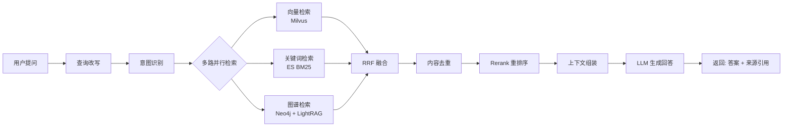
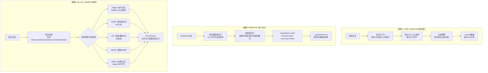
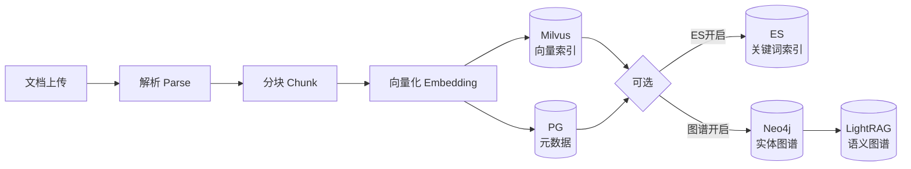
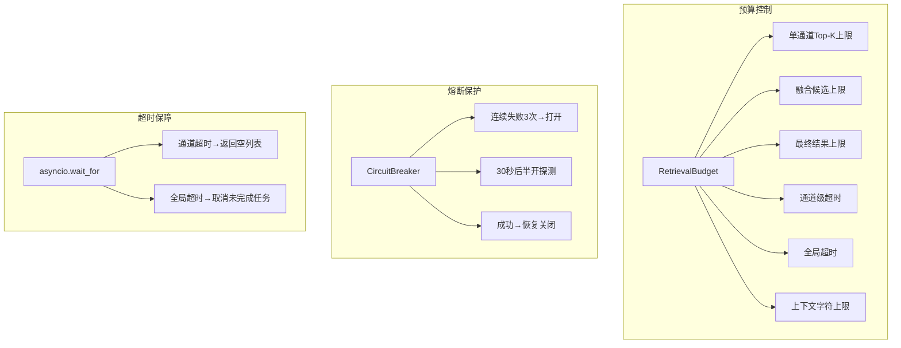
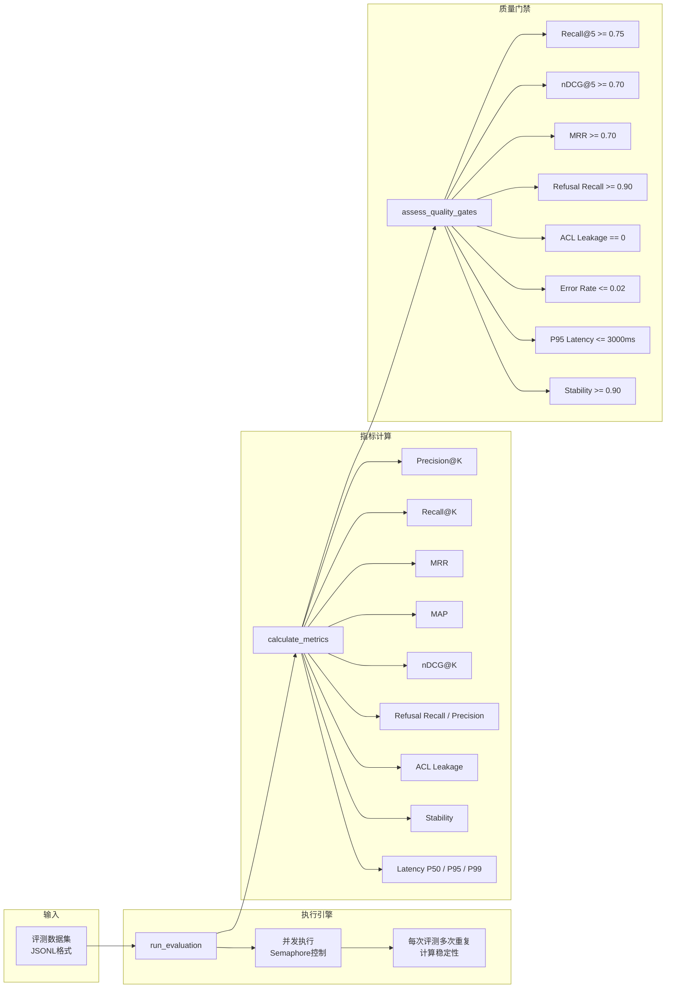
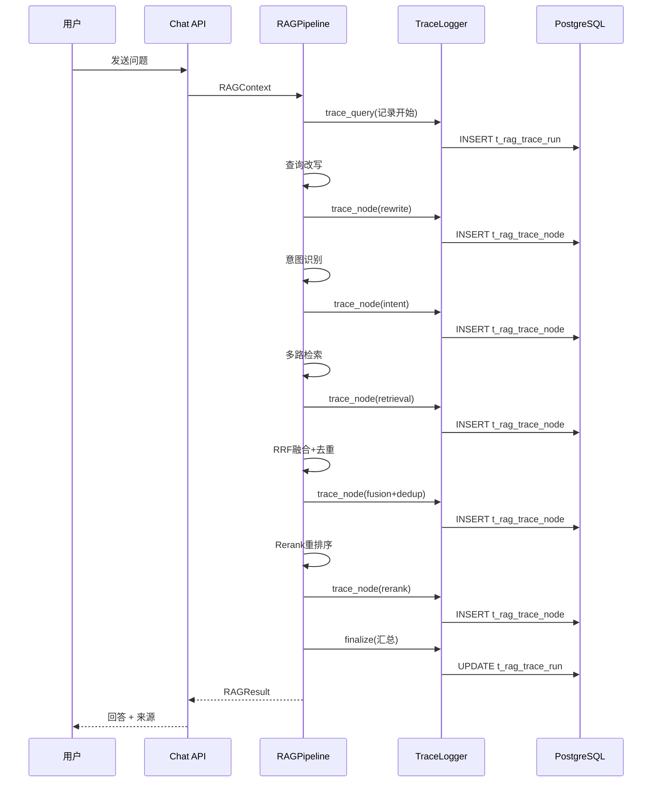
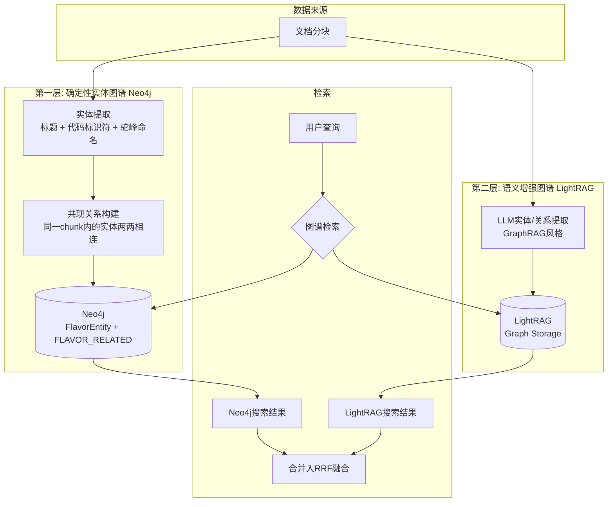
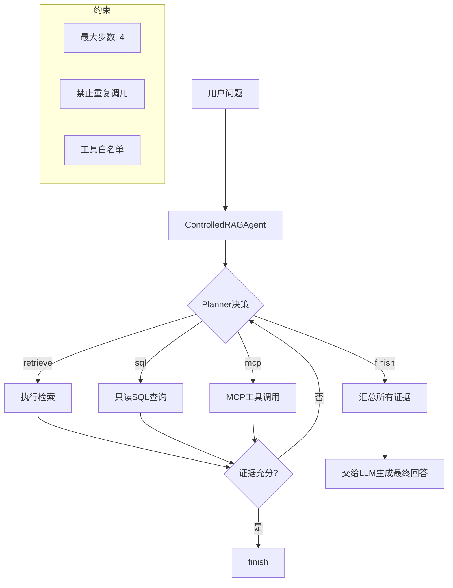
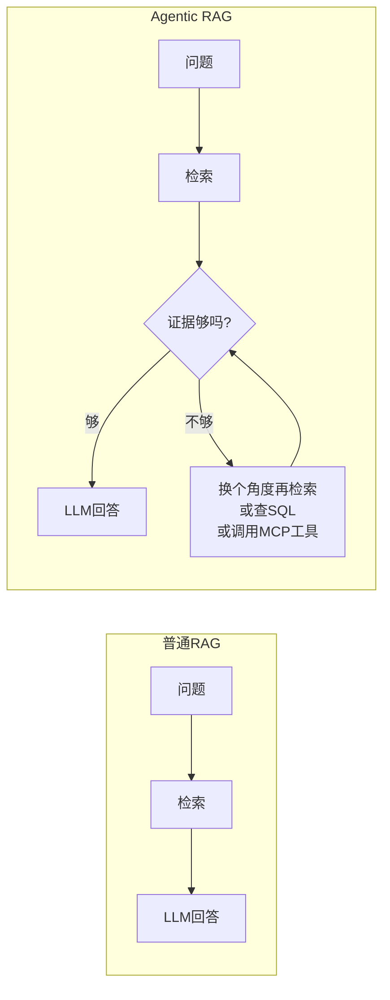

# Flavor-RAG 技术方案文档

> 版本：v1.0 | 日期：2026-07-26 | 状态：生产就绪（68/68 测试全绿）

---

## 目录

1. [系统总览](#1-系统总览)
2. [分块逻辑](#2-分块逻辑)
3. [召回逻辑](#3-召回逻辑)
4. [评测体系](#4-评测体系)
5. [链路监控](#5-链路监控)
6. [Graph RAG](#6-graph-rag)
7. [Agentic RAG](#7-agentic-rag)
8. [附录：配置速查](#8-附录配置速查)

---

## 1. 系统总览

### 1.1 定位

Flavor-RAG 是一个面向企业的 RAG（Retrieval-Augmented Generation）智能问答系统。它采用 **Python FastAPI + React** 技术栈，完整覆盖从文档入库到智能问答的全链路。核心思路是：**先把企业文档变成可检索的"知识块"，再用多路检索 + 重排序从这些块里找到最相关的内容，最后交给大模型生成可信回答。**

### 1.2 核心流程

一句话概括：**用户提问 → 问题改写 → 意图识别 → 多路并行检索 → RRF 融合 → 去重 → Rerank 重排序 → 大模型生成回答 → 返回带来源引用的答案。**



### 1.3 技术栈一览

| 层次 | 技术选型 | 用途 |
|------|---------|------|
| Web 框架 | FastAPI (Python 3.11+) | REST/SSE 服务 |
| 前端 | React + Vite + TypeScript | 管理后台 + 问答界面 |
| 关系数据库 | PostgreSQL + SQLAlchemy | 元数据、会话、链路追踪 |
| 向量数据库 | Milvus (IVF_FLAT + Cosine) | 语义向量检索 |
| 关键词检索引擎 | Elasticsearch (BM25) | 关键词全文检索 |
| 图数据库 | Neo4j + LightRAG | 实体关系图谱 |
| 缓存/限流 | Redis | 滑动窗口限流 |
| 对象存储 | RustFS (S3 兼容) | PDF 图片/附件存储 |
| 嵌入模型 | Qwen3-Embedding-8B (4096维) | 文本向量化 |
| 重排序模型 | Qwen3-Reranker-8B | 召回结果精排 |
| LLM | Qwen-Plus / DeepSeek-V3 | 回答生成 |

---

## 2. 分块逻辑

分块（Chunking）是 RAG 系统最基础也是最关键的一步。分得太粗，检索精度差；分得太细，语义碎片化。Flavor-RAG 提供**三种分块策略**，支持从不同文档类型中自动选择最优方式。

### 2.1 三种分块策略对比



**一句话总结**：FIXED_WINDOW 最简单粗暴、兼容性最好；SEMANTIC 适合格式规范的 Markdown；BLOCK_AWARE 最智能，能区分表格/代码/列表/段落分别处理，是复杂文档的首选。

### 2.2 FIXED_WINDOW 详解

核心参数：
- `chunk_size`: 块大小，默认 512 字符
- `overlap_size`: 重叠大小，默认 128 字符（即相邻块之间共享 128 字符，防止关键信息被切断）

边界调整逻辑（`_adjust_to_boundary`）按优先级从高到低：
1. **换行符 `\n`**：优先在段末断开
2. **中文句末标点**：`。！？`
3. **英文句末标点**：`. ! ?`（需后跟空格或行尾）

文本归一化（`_normalize_text`）处理了两个常见坑：
- **URL 断行修复**：文档中 URL 被换行切断（如 `https://example.com\n/path`），会自动合并回一行
- **CJK 行中断行**：中文文本中插入的无意义换行（前后都是 CJK 字符），自动移除

### 2.3 SEMANTIC 详解

专为 Markdown 设计，利用结构信息做自然切分：
- 以标题（`#` ~ `######`）作为自然分段边界
- 保留代码块（`` ``` ``）、表格、图片的完整性
- 段落按 `targetChars=1400`、`minChars=600`、`maxChars=1800` 控制大小
- 不设字符级 overlap，因为标题层级本身就是上下文

### 2.4 BLOCK_AWARE 详解（推荐用于混合文档）

这是最精细的策略。首先通过**词法扫描器**将文档解析为不同类型的块（Block），然后每种类型有独立的切分逻辑：

| 块类型 | 识别方式 | 切分策略 | 特殊处理 |
|--------|---------|---------|---------|
| TABLE | `\|...\|` 行模式 | 按行切分，每批 20 行 | 同时生成 `key: value` 格式便于搜索 |
| CODE | ` ``` ` 围栏 | 按行切分，每批 80 行 | 保持代码完整性 |
| HEADING | `#` 开头行 | 作为路径前缀，不单独切分 | 挂载到后续段落 |
| LIST | `- / * / 1.` 开头 | 按条目数切分，每批 30 条 | 小列表保持完整 |
| IMAGE | `` | 提取 alt 文本 | 生成 `[图片: alt]` |
| PARA | 其他文本 | 句边界切分，target=800 | 优先断在句号/换行 |

切分完成后还有 **ChunkPacker** 步骤：扫描所有块，将字符数小于 `minChars`（默认 300）的相邻小块合并，避免造成语义碎片化。

### 2.5 复杂 PDF 分块

对于包含图片、表格的复杂 PDF，系统走专门的 PDF 解析流水线：

```
PDF文件 → pypdfium2提取文字+坐标 → OCR补充低文字区域 → VLM图片理解(可选)
→ pdfplumber提取表格 → 结构化合并 → StructuredPdfChunker分块
```

分块时会保留：
- 页面坐标（`page_start`/`page_end`/`bbox_json`）—— 用于回答中标亮原文位置
- 图片资产的 ID 引用 —— 用于前端展示相关图片

### 2.6 入库流水线

分块只是入库流水线中的一环。完整流程：



入库过程中的性能指标（解析耗时、分块耗时、嵌入耗时、总耗时）全部写入 `t_knowledge_document_chunk_log` 表，便于后续分析优化。

---

## 3. 召回逻辑

召回是 RAG 系统的心脏。Flavor-RAG 采用 **多路并行检索 + RRF 融合 + Rerank 精排** 的三层架构，从"海选"到"精选"逐步聚焦。

### 3.1 检索前处理：查询改写与意图识别

在真正检索之前，系统先做两件事：

#### 3.1.1 查询改写（Query Rewrite）

解决口语化、指代消解、信息补全问题。流程分两层：

**第1层 - 术语映射（Term Mapping）**：数据库驱动的规则替换。管理员可以在后台配置"用户常说的词 → 系统应该搜的词"的映射表，比如"K8s" → "Kubernetes"。匹配时优先长词、优先 KB 级配置。

**第2层 - LLM 改写**（可选，配置 `rewrite_enabled=true`）：调用 LLM 将口语转书面语，消解历史对话中的指代，复合问题拆成原子子问题（最多 3 个）。

#### 3.1.2 意图识别（Intent Recognition）

将用户问题路由到正确的知识库和检索策略。支持两种模式：

- **词法匹配（Fallback）**：计算问题中的关键词与意图树节点（名称、描述、示例）的重合度，快但不精准
- **LLM 分类（推荐）**：将候选意图发给 LLM 做语义匹配，返回评分和理由。只保留评分 ≥ `intent_min_score`（0.30）的结果

意图树支持层级结构，例如：
```
ROOT
├── 代码搜索 (→ DeepSeek-V3)
├── 文档问答 (→ Qwen-Plus)
├── 数据查询 (→ SQL Tool)
└── 通用问答
```

每个叶子节点可配置：目标知识库、检索通道（vector/keyword/graph）、Prompt 模板、评分阈值。当 LLM 分类前两名意图接近（差距 ≤ 0.08）且目标不同时，系统会生成引导问题让用户选择。

### 3.2 三路并行检索

检索由 **RAGPipeline** 统一编排，三个通道并发执行，受 `RetrievalBudget` 统一约束：

| 参数 | 默认值 | 含义 |
|------|--------|------|
| `per_channel_top_k` | 12 | 每个通道召回数量 |
| `max_candidates` | 40 | 融合后最大候选数 |
| `final_top_k` | 5 | 最终返回给 LLM 的块数 |
| `channel_timeout_ms` | 30000 | 单通道超时 |
| `total_timeout_ms` | 35000 | 全局超时 |
| `context_max_chars` | 12000 | LLM 上下文窗口上限 |

#### 3.2.1 向量检索（Milvus）

```
用户问题 → Embedding模型(Qwen3-Embedding-8B) → 4096维向量
    → Milvus COSINE相似度检索 → Top-K 结果
```

- **索引类型**：IVF_FLAT（`nlist=128`），检索时 `nprobe=16`
- **相似度**：Cosine Similarity
- **集合命名**：`rag_{collection_name}` 前缀隔离不同知识库

#### 3.2.2 关键词检索（Elasticsearch BM25）

```
用户问题 → ES match查询(content字段)
    → bool过滤(kb_id) → BM25评分 → Top-K 结果
```

- 索引名：`rag_keyword_store`
- 查询策略：`match` 查询 + `term` 过滤（按知识库隔离）
- 优雅降级：ES 不可用时返回空列表，不影响向量检索

#### 3.2.3 图谱检索（Neo4j + LightRAG 双通道）

参见 [第 6 节 Graph RAG](#6-graph-rag)。

### 3.3 RRF 融合（Reciprocal Rank Fusion）

RRF 是融合多个排序列表的经典算法，核心公式：

```
RRF_score(d) = Σ ( weight_channel / (k + rank_in_channel) )
```

其中 `k=60`（平滑常数），权重默认 `vector:1.0, keyword:1.0, graph:0.65`。

**为什么用 RRF 而不是简单的分数加权？** 因为不同通道的分数不可直接比较（Milvus 的 Cosine 相似度 vs ES 的 BM25 得分）。RRF 只关心"排名"，天然跨通道可比。

融合后每个结果都记录了 **通道归因**（来自哪些通道、各自的排名和贡献），方便排查"为什么这个块排在前面"。

### 3.4 内容去重

使用 **Jaccard 相似度**（字符级 3-gram）检测近似重复：

```
Jaccard(A, B) = |A ∩ B| / |A ∪ B|

去重阈值: content_threshold = 0.9
```

去重时不是简单丢弃，而是**合并通道归因**：如果 A 和 B 相似，保留 A，把 B 的通道贡献合并到 A 上。

### 3.5 Rerank 重排序

这是精排阶段。支持三种策略：

| 策略 | 说明 | 适用场景 |
|------|------|---------|
| `CROSS_ENCODER` (默认) | 调用远程 Reranker API（如 SiliconFlow Qwen3-Reranker-8B） | 高质量精排 |
| `LLM_BASED` | 提示 LLM 从候选中选出最相关文档 | Reranker API 不可用时的备选 |
| `PASSTHROUGH` | 不做重排序，直接返回 Top-N | 调试/降级 |

**Cross-Encoder 流程**：将所有候选文档和 Query 一起发给 Reranker 模型，模型输出每个文档的 `relevance_score`，按分数重新排序。同时受 Circuit Breaker 保护（连续失败 3 次打开断路器，30 秒后进入半开状态）。

Rerank 之后进入 **Context Selection**：
1. 过滤 `score < min_relevance_score`（0.01）的结果
2. **文档多样性优先**：同一文档的多个块交叉排列，避免单文档垄断
3. 按 `final_top_k`（5）和 `context_max_chars`（12000）截断

### 3.6 安全过滤与元数据补齐

检索结果在返回前还要经过两道关卡：

**1. 可用性过滤**（`_filter_unavailable_chunks`）：数据库中标记为 `enabled=0` 或 `deleted=1` 的块不会被返回。即使搜索引擎的索引还没同步更新，数据库也是最终裁决者。

**2. ACL 权限过滤**（`filter_authorized_results`）：根据用户的 `tenant_id`、`department_id`、`role` 和资源的 ACL 记录过滤，防止跨租户/跨部门数据泄露。

**3. 元数据补全**（`_resolve_metadata`）：用块内容的 SHA256 哈希从 PostgreSQL 中反查文档名、块序号、图片资产等元数据，因为向量/关键词索引中不存储这些字段。

### 3.7 检索治理（Retrieval Governance）

整个检索链路受多层保护：



**通道状态追踪**：每次检索后记录每个通道的状态（success/timeout/error）、耗时、命中数，通过日志和 Trace 输出。

---

## 4. 评测体系

Flavor-RAG 的评测不是一次性行为，而是内建在系统中的**持续质量保障机制**。

### 4.1 评测架构



### 4.2 数据集格式

评测数据集为 **JSONL 格式**（每行一条评测用例）：

```json
{
  "id": "case_001",
  "question": "Kubernetes中如何配置自动扩缩容？",
  "expected_chunk_ids": ["chunk_a", "chunk_b"],
  "expected_doc_ids": ["doc_k8s_guide"],
  "relevance_grades": {"chunk_a": 1.0, "chunk_b": 0.8},
  "category": "document_qa",
  "answerable": true,
  "difficulty": "medium",
  "tags": ["kubernetes", "hpa"],
  "language": "zh-CN",
  "active": true
}
```

### 4.3 四大类指标

#### 4.3.1 检索质量指标

| 指标 | 计算方式 | 含义 |
|------|---------|------|
| **Precision@K** | 前K个结果中命中数 / K | 检索精度 |
| **Recall@K** | 前K个结果中命中数 / 期望命中总数 | 检索召回率 |
| **Hit Rate@K** | 前K个结果中至少命中一个的比例 | 是否"找到了" |
| **MRR** (Mean Reciprocal Rank) | 第一个命中位置倒数的均值 | 首个正确答案的排序质量 |
| **MAP** (Mean Average Precision) | 各召回点精度的均值 | 综合考虑精度和排序 |
| **nDCG@K** | 归一化折损累积增益 | 考虑相关性分级的排序质量 |
| **Doc Recall@K** | 文档级召回率 | 是否正确找到了文档 |

#### 4.3.2 回答能力指标

| 指标 | 含义 |
|------|------|
| **Refusal Recall** | 对于不可回答问题，系统正确拒绝的比例 |
| **Refusal Precision** | 系统拒绝的回答中，确实不该回答的比例 |
| **Refusal F1** | 拒绝能力的综合评估 |
| **Answerability Accuracy** | 系统判定可答/不可答的准确率 |

#### 4.3.3 安全与稳定性指标

| 指标 | 含义 |
|------|------|
| **ACL Leakage Count** | 权限泄露的块数（必须为 0） |
| **ACL Leakage Rate** | 出现权限泄露的用例比例 |
| **Error Rate** | 评测执行出错的用例比例 |
| **Stability** | 多次运行结果的 Jaccard 一致性 |

#### 4.3.4 性能指标

| 指标 | 含义 |
|------|------|
| **Latency P50** | 50% 请求的延迟 |
| **Latency P95** | 95% 请求的延迟（关注长尾） |
| **Latency P99** | 99% 请求的延迟 |

### 4.4 综合质量评分与门禁

**Quality Score** 加权公式：

```
Quality = Recall@K × 0.30 + nDCG@K × 0.20 + MRR × 0.15
        + Refusal_Recall × 0.15 + Stability × 0.10 + Pass_Rate × 0.10
```

**8 道硬门禁**（全部通过才算合格）：

1. `recall@5 >= 0.75`
2. `ndcg@5 >= 0.70`
3. `mrr >= 0.70`
4. `refusal_recall >= 0.90`
5. `acl_leakage_count == 0`（**一票否决**）
6. `error_rate <= 0.02`
7. `latency_p95_ms <= 3000`
8. `stability >= 0.90`

### 4.5 可选检索能力的投资决策框架

对于 GraphRAG、视觉检索等可选能力，系统提供了 **数据驱动的投资决策框架**（`InvestmentDecision`）：

```
ENABLE:  有足够标注样本 + Recall 提升 ≥ 0.05 + P95 延迟 ≤ 3s
HOLD:    标注样本不足（至少需要 5 个），继续积累数据
DISABLE: 有足够标注但提升不达标
```

---

## 5. 链路监控

Flavor-RAG 的链路监控覆盖**检索链路**和**入库链路**两条主线，所有数据持久化到 PostgreSQL，可通过管理后台的可视化界面查询。

### 5.1 检索链路追踪（Trace）



### 5.2 追踪数据模型

**t_rag_trace_run**（一次检索的完整记录）：

| 字段 | 说明 |
|------|------|
| `query` | 原始查询 |
| `rewrite_query` | 改写后的查询 |
| `intent` | 意图分类结果 |
| `search_duration_ms` | 检索总耗时 |
| `llm_duration_ms` | LLM 生成耗时 |
| `total_duration_ms` | 全链路耗时 |
| `recall_count` | 融合后候选数 |
| `final_count` | 最终返回数 |
| `model_name` | 使用的 LLM 模型 |
| `status` | success / error |
| `rejection_reason` | 拒绝原因（如有） |

**t_rag_trace_node**（每个环节的细节）：

| 字段 | 说明 |
|------|------|
| `node_type` | rewrite / intent / retrieval / fusion / rerank |
| `start_time` / `end_time` | 精确起止时间 |
| `duration_ms` | 环节耗时 |
| `input_data` | 输入快照（JSON） |
| `output_data` | 输出快照（JSON） |
| `status` | success / error |

### 5.3 入库链路监控

入库流水线同样有完整的监控体系：

**IngestionPipeline** 层面（`t_ingestion_task` + `t_ingestion_task_node`）：
- 每个入库任务有 ID、trace_id、幂等键（防止重复提交）
- 每个节点（fetcher/parser/chunker/enricher/enhancer/indexer）的执行状态、耗时、重试次数独立记录
- SLA 监控（默认 300s，超时标记）
- 心跳机制：长时间运行的节点定期更新 `heartbeat_at`

**文档层面**（`t_knowledge_document_chunk_log`）：
- 解析耗时（`extract_duration`）
- 分块耗时（`chunk_duration`）
- 嵌入耗时（`embed_duration`）
- 持久化耗时（`persist_duration`）
- 总分块数（`chunk_count`）
- 使用的分块策略（`chunk_strategy`）

### 5.4 日志体系

日志按模块分级输出（使用 Python `logging` + structlog 风格）：

| Logger 名称 | 覆盖范围 |
|-------------|---------|
| `flavorag.rag.pipeline` | 检索全链路 |
| `flavorag.rag.reranker` | Rerank 阶段 |
| `flavorag.rag.rewrite` | 查询改写 |
| `flavorag.rag.intent` | 意图识别 |
| `flavorag.ingestion.pipeline` | 入库全链路 |
| `flavorag.ingestion.engine` | DAG 流水线引擎 |
| `flavorag.index_sync` | 索引同步 |

日志关键事件包括：
- `rag_pipeline_start` / `rag_pipeline_complete`
- `rewrite` / `intent` / `multi_search_complete`
- `fusion_complete` / `dedup_complete`
- `rerank_pre` / `rerank_post`（含排序变化）
- `disabled_chunks_filtered`（不可用块过滤统计）
- `ingestion_start` / `ingestion_complete`
- `pipeline_node_retry`（节点重试）

### 5.5 管理后台可视化

系统提供 `TracesPage`（前端 `flavorag-frontend/src/pages/admin/TracesPage.tsx`）和 `HealthPage` 用于：
- 按时间范围查询 Trace 记录
- 查看每次问答的完整链路节点时序
- 对比各环节耗时分布
- 排查异常节点和错误信息

---

## 6. Graph RAG

### 6.1 总体设计：双层图谱架构

Flavor-RAG 采用 **"确定性基础图谱 + 语义增强图谱"** 的双层架构，确保即使 LightRAG 的 LLM 提取服务不可用，图谱检索仍能工作。



### 6.2 确定性实体图谱（Neo4j）

这是图谱的基础保障层，**不依赖 LLM**。

**实体提取**（`extract_entities`）：
1. **Markdown 标题**：`#{1,6} text` → 类型 `section`
2. **代码标识符**：反引号包裹的文本 `` `text` `` → 类型 `identifier`
3. **驼峰/路径命名**：`CamelCase`, `a/b/c` → 类型 `identifier`
4. 限制：每个文档最多 12 个实体，名称长度 2-80 字符

**关系构建**（`upsert_chunks`）：
- 同一块内的实体两两之间创建 `FLAVOR_RELATED` 边（共现关系）
- 上限：每个块最多 8 个实体参与组网（避免 API 文档等密集块的平方爆炸）
- 文档重新入库时，该文档的旧节点会被 `DETACH DELETE` 后重建

**检索**（`search`）：
```cypher
MATCH (entity:FlavorEntity {kb_id: $kb_id})
WHERE any(term IN $terms
    WHERE toLower(entity.name) CONTAINS term
       OR toLower(entity.description) CONTAINS term)
RETURN entity.chunk_id, entity.content, entity.name, score
ORDER BY score DESC, size(entity.name) ASC
LIMIT $limit
```
- 查询词从用户问题中提取（英文标识符 + 中文词 ≥ 2 字符）
- 名称精确匹配得分 1.0，描述匹配得分 0.72
- 按名称长度升序排列（更短的名称通常更精确）

### 6.3 语义增强图谱（LightRAG）

在 Neo4j 基础图谱之上，可选启用 LightRAG 做深度的语义实体/关系提取。

**入库**：每个文档的完整文本（所有块的拼接）发送给 LightRAG 的 `/documents/text` 接口，由 LightRAG 内部的 LLM 做 GraphRAG 风格的实体和关系抽取。

**检索**（`query_graph`）：调用 LightRAG 的 `/query` 接口，使用 `mix` 模式（结合 local/global/naive 三种模式），`top_k=5`。同时要求返回 `references`（引用来源）和 `chunk_content`（原文内容）。

**超时和降级**：
- LightRAG 查询设为短超时（0.5s ~ 1.5s，根据通道超时动态计算）
- 超时或失败时，只使用 Neo4j 的搜索结果
- 用户可以手动开启/关闭 Graph RAG（HTTP 请求携带 `graph_rag` 参数）

**图谱可视化**：
- `/graphs` 接口获取子图（支持实体名搜索、深度限制、节点数限制）
- `/graph/label/search` 和 `/graph/label/popular` 获取实体标签
- 前端使用 `KnowledgeGraphPanel` 组件渲染交互式知识图谱

### 6.4 图谱检索结果如何融入主流程

图谱检索的 `SearchResult` 和其他通道一样进入 RRF 融合，默认权重稍低（`graph:0.65` vs `vector:1.0, keyword:1.0`）。图谱结果的 `metadata` 中带 `graphEntity` 字段，标明匹配到的实体名。

**当前状态**：根据投资决策框架的评估，由于缺少足够的标注多跳评测样本，GraphRAG 目前默认关闭（`graph_enabled=false`），等待积累更多数据。

---

## 7. Agentic RAG

### 7.1 设计理念

Agentic RAG 给检索增加了 **"多步推理"** 的能力。传统 RAG 是"一次检索+一次回答"，Agentic RAG 则是"检索→评估证据→（可选）再检索→（可选）调用工具→最终回答"。

核心约束：**受控循环**，不允许 Agent 自由执行任意操作。每次行动必须是预注册工具列表中的合法操作，步数有硬上限。

### 7.2 架构



### 7.3 ControlledAgent 核心机制

**Planner**（`plan_next_action`）：
- 调用 LLM（温度=0，保证确定性），要求返回下一步行动
- 只允许白名单中的工具，不允许编造
- 返回格式：`{"tool":"retrieve|sql|finish", "arguments":{...}}`
- 解析失败 → 自动 `finish`

**Agent 循环**（`ControlledAgent.run`）：
1. 初始状态：问题 + 空步骤列表
2. Planner 决策下一步
3. 如果 `tool == "finish"`：退出循环，返回结果
4. 如果调用签名与历史重复：退出循环，防止死循环
5. 执行工具，记录观察结果
6. 达到 `max_steps`（默认 4）：退出循环

### 7.4 可用工具

| 工具 | 说明 | 注册条件 |
|------|------|---------|
| `retrieve` | 调用完整 RAG 检索链路 | 始终可用 |
| `sql` | 只读 SQL 查询（白名单表） | `sql_tool_enabled=true` |
| `mcp:*` | MCP 协议工具（可配置多个） | `mcp_tool_enabled=true` |

**SQL 工具安全限制**：
- 只允许 `SELECT` 语句
- 只允许 `sql_tool_allowed_relations` 配置的白名单表
- 使用 `sqlalchemy.text` + 绑定参数，防注入
- 结果集限制 100 行

**MCP 工具**：
- 通过 JSON 配置多个 MCP 端点
- 每个工具独立配置只读属性、超时时间
- `mcp_allowed_tools` 控制哪个工具可用

### 7.5 Agentic RAG 与普通 RAG 的区别



Agentic RAG 的结果中：
- `context_chunks` 包含所有检索到的文本块
- `sources` 中新增 `blockType: "TOOL_RESULT"` 的工具调用结果
- `agent_steps` 记录每一步的工具名、参数、观察结果

### 7.6 启用方式

通过配置 `agentic_rag_enabled=true` 全局启用，或由 API 调用方按请求指定。当前默认关闭。

---

## 8. 附录：配置速查

### 8.1 关键环境变量

```bash
# === 嵌入模型 ===
EMBEDDING_MODEL=Qwen/Qwen3-Embedding-8B    # 嵌入模型 (4096维)
EMBEDDING_BASE_URL=https://api.siliconflow.cn/v1

# === LLM ===
LLM_MODEL=qwen-plus-latest                  # 默认LLM
CODE_MODEL=deepseek-v3                      # 代码类问题专用
DOC_MODEL=qwen-plus-latest                  # 文档类问题专用
REASONING_MODEL=                            # 深度思考模型 (可选)

# === Reranker ===
RERANKER_MODEL=Qwen/Qwen3-Reranker-8B
RERANKER_ENABLED=true

# === 向量数据库 ===
MILVUS_URI=http://localhost:19530

# === 关键词检索 (可选) ===
ES_URIS=http://127.0.0.1:9200
ES_ENABLED=true

# === 图谱检索 (可选) ===
GRAPH_ENABLED=false
LIGHTRAG_BASE_URL=http://127.0.0.1:9621
NEO4J_URI=neo4j://127.0.0.1:7687

# === Agentic RAG (可选) ===
AGENTIC_RAG_ENABLED=false
AGENT_MAX_STEPS=4

# === 检索参数 ===
RETRIEVAL_PER_CHANNEL_TOP_K=12
RETRIEVAL_MAX_CANDIDATES=40
RETRIEVAL_FINAL_TOP_K=5
RETRIEVAL_CHANNEL_TIMEOUT_MS=30000
RETRIEVAL_TOTAL_TIMEOUT_MS=35000
```

### 8.2 Docker 服务编排

| 文件 | 服务 | 端口 |
|------|------|------|
| `docker/infra-stack.compose.yaml` | PostgreSQL + Redis + RustFS | 5432, 6379, 9000 |
| `docker/milvus-stack.compose.yaml` | Milvus (向量数据库) | 19530 |
| `docker/es-stack.compose.yaml` | Elasticsearch (可选) | 9200 |
| `docker/lightrag-neo4j-stack.compose.yaml` | LightRAG + Neo4j (可选) | 9621, 7687 |
| `docker/rocketmq-stack.compose.yaml` | RocketMQ (可选) | 9876 |
| `docker/app.compose.yaml` | 应用镜像 | 9090 |

---

> **文档维护**：本文档基于 `flavorag-server/app/` 下的实际源码编写，与代码保持同步更新。
